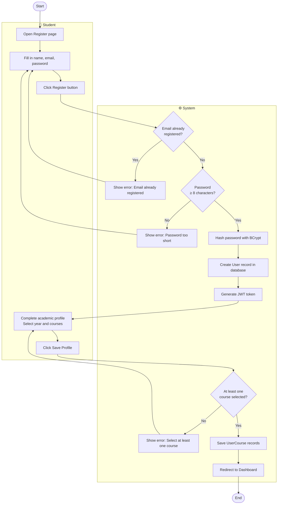
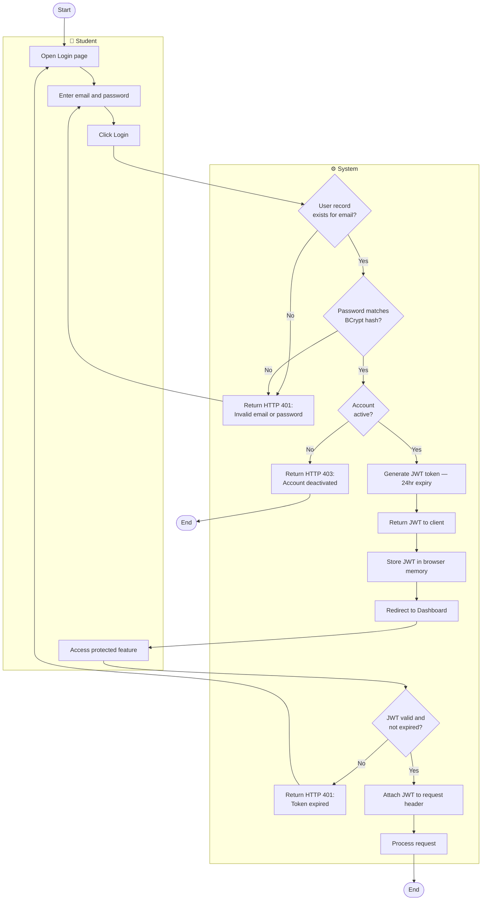
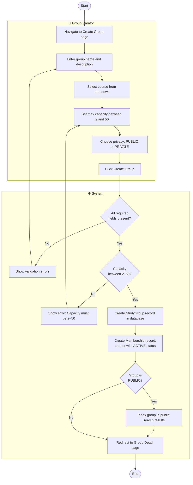
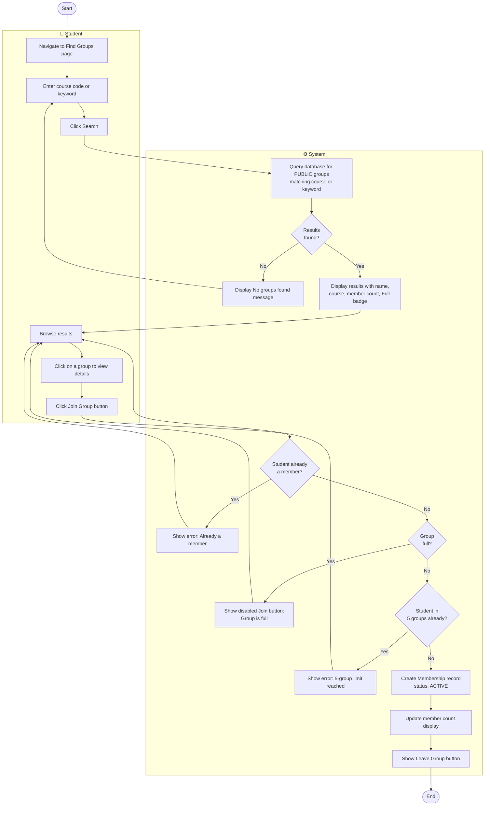
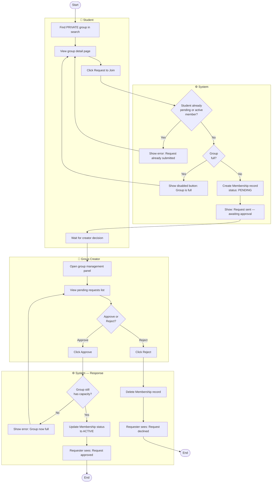
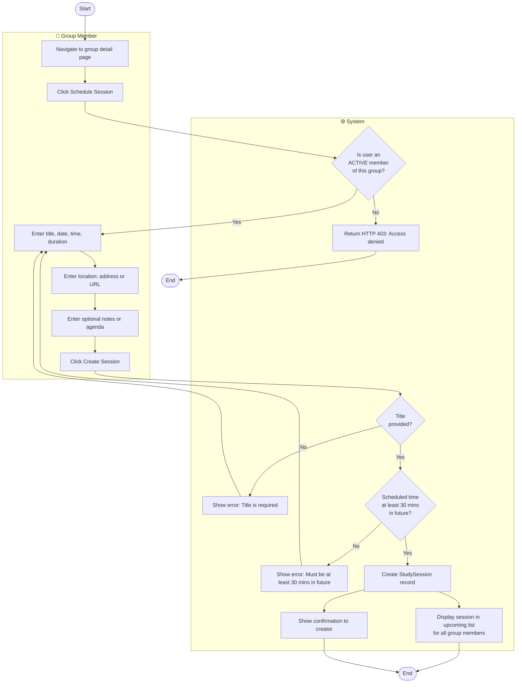
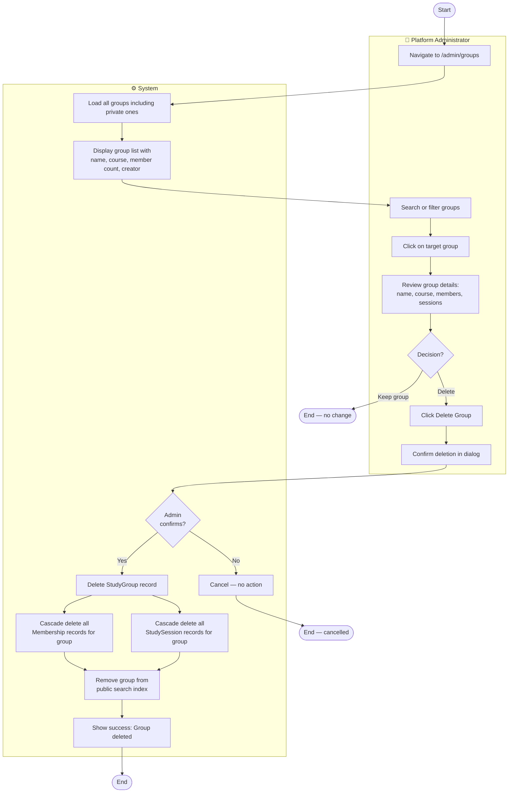
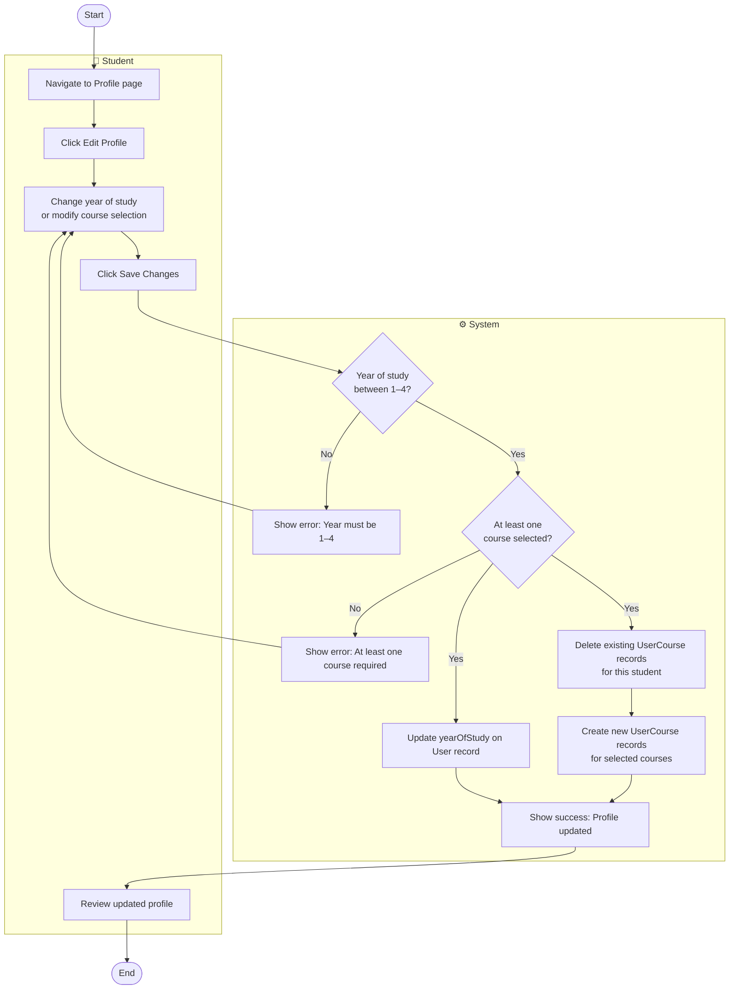

# ACTIVITY_DIAGRAMS.md — Activity Workflow Modeling
## StudySync: Study Group Finder System

---

## 1. Introduction

This document models 8 complex workflows in the StudySync system using UML activity diagrams. Each diagram shows the start and end points, actions, decision nodes, parallel actions, and swimlanes identifying which actor or system component is responsible for each step.

### Traceability
| Workflow | Linked FR | Linked US | Linked UC |
|---|---|---|---|
| User Registration | FR-01, FR-03 | US-001, US-003 | UC-01, UC-03 |
| Login and Authentication | FR-02 | US-002 | UC-02 |
| Create Study Group | FR-04 | US-005 | UC-04 |
| Search and Join Public Group | FR-05, FR-06 | US-006, US-007 | UC-05, UC-06 |
| Private Group Join Request | FR-07 | US-008, US-009 | UC-07 |
| Schedule Study Session | FR-09 | US-010 | UC-08 |
| Admin Moderates a Group | FR-12 | US-013 | — |
| Edit Academic Profile | FR-03 | US-004 | UC-03 |

---

## 2. Workflow 1 — User Registration

### Explanation

This workflow covers the complete onboarding flow from first visiting the register page to landing on the dashboard. Two key decision nodes enforce data integrity: the duplicate email check prevents multiple accounts per address (FR-01 acceptance criteria), and the password length check enforces the minimum security requirement. The parallel concern of profile completion is handled sequentially — the student cannot reach the dashboard without completing their profile. This directly addresses the New Student stakeholder concern of a clear, guided onboarding experience.

**Stakeholder concern addressed:** New Student needs to find and join groups quickly — this workflow ensures their profile is complete before they can search.

---

## 3. Workflow 2 — Login and Authentication

### Explanation

This workflow has two phases — the initial login flow and the subsequent authenticated request flow. The three decision nodes guard against the three failure cases defined in FR-02: non-existent email, wrong password, and deactivated account. Importantly, the error message for both "user not found" and "wrong password" is identical ("Invalid email or password") — this is a deliberate security measure to prevent email enumeration attacks. The second phase shows how every subsequent request uses the stored JWT, addressing the stateless architecture requirement in NFR-SC2.

**Stakeholder concern addressed:** IT Staff concern about security — BCrypt validation and JWT expiry enforce the authentication NFRs.

---

## 4. Workflow 3 — Create Study Group

### Explanation

Group creation is a straightforward linear workflow with two validation gates. The capacity validation is a separate decision node from the general field validation because it has a specific numeric constraint (2–50) that warrants its own error message. The split after group creation based on privacy setting reflects a real functional difference — only public groups are indexed for search, which is what drives the FR-05 search feature. The creator's automatic membership creation is shown as a parallel system action, not a user action, making it clear this happens without any additional user input.

**Stakeholder concern addressed:** Group Creator needs to quickly set up a group with the right privacy settings — the workflow makes both paths (public/private) explicit.

---

## 5. Workflow 4 — Search and Join Public Group

### Explanation

This workflow is the core value loop of StudySync — the primary way a student finds and joins a study group. Four sequential guard checks ensure data integrity before the membership is created: existing membership, group capacity, and the 5-group limit. Each failure path loops back to browsing results, not back to the search input, because the student has already found groups they are interested in. The parallel actions of updating member count and showing the Leave button reflect immediate UI feedback without requiring a page refresh.

**Stakeholder concern addressed:** Student and New Student pain point — finding relevant groups quickly. The search returns results in under 1 second (NFR-P2) and shows capacity status upfront.

---

## 6. Workflow 5 — Private Group Join Request

### Explanation

This is the most actor-rich workflow in the system, involving both the requesting student and the group creator as active participants. The workflow is split across two sessions — the student submits the request and then waits, while the creator reviews asynchronously. The guard condition on approval (`group still has capacity`) handles the race condition where a group fills up while a request is pending — a scenario that could cause data inconsistency without this check. The two terminal paths (approved and rejected) both clean up correctly.

**Stakeholder concern addressed:** Group Creator's need to control group membership quality. Student's need for clear feedback on their request status.

---

## 7. Workflow 6 — Schedule Study Session

### Explanation

Session scheduling has two access control checks before any input validation — the system first verifies the requester is an active member before showing them the form (preventing unauthorised access) and then validates the future-time constraint. The parallel fork at the end — updating the sessions list for all members AND showing a confirmation to the creator simultaneously — reflects a real concurrent system action where both happen in the same API response. This addresses the scalability concern from the IT Staff stakeholder: all members see the session without requiring individual requests.

**Stakeholder concern addressed:** Lecturer and Group Creator stakeholders want sessions tied to specific courses and viewable by all members immediately.

---

## 8. Workflow 7 — Admin Moderates a Group

### Explanation

The admin moderation workflow includes a confirmation dialog step before the irreversible delete action — this is a safeguard against accidental deletion. The cascade delete is shown as parallel actions (memberships and sessions deleted simultaneously) because in the database implementation these are handled by foreign key cascade constraints rather than sequential queries. The parallel merge before showing success ensures the admin only sees the confirmation once both cascades are complete. This workflow directly addresses the University Administrator's concern about being able to remove inappropriate groups quickly.

**Stakeholder concern addressed:** University Administrator and Platform Administrator need to enforce academic policy by removing inappropriate or inactive groups. FR-12 acceptance criteria requires cascade deletion to leave no orphan records.

---

## 9. Workflow 8 — Edit Academic Profile

### Explanation

Profile editing uses a replace-all strategy for course enrolments — rather than calculating a diff between old and new courses, the system deletes all existing UserCourse records and recreates them from the new selection. This is shown as a parallel action alongside updating the year of study. This approach is simpler to implement and equally correct since the user always sees the full list of their enrolled courses. The two guard conditions (year range and minimum one course) match exactly the constraints defined in UC-03 and US-004.

**Stakeholder concern addressed:** Student needs to update their courses at the start of each new semester without losing their account or group memberships. Lecturer stakeholder benefits from accurate course data ensuring groups remain linked to active modules.
