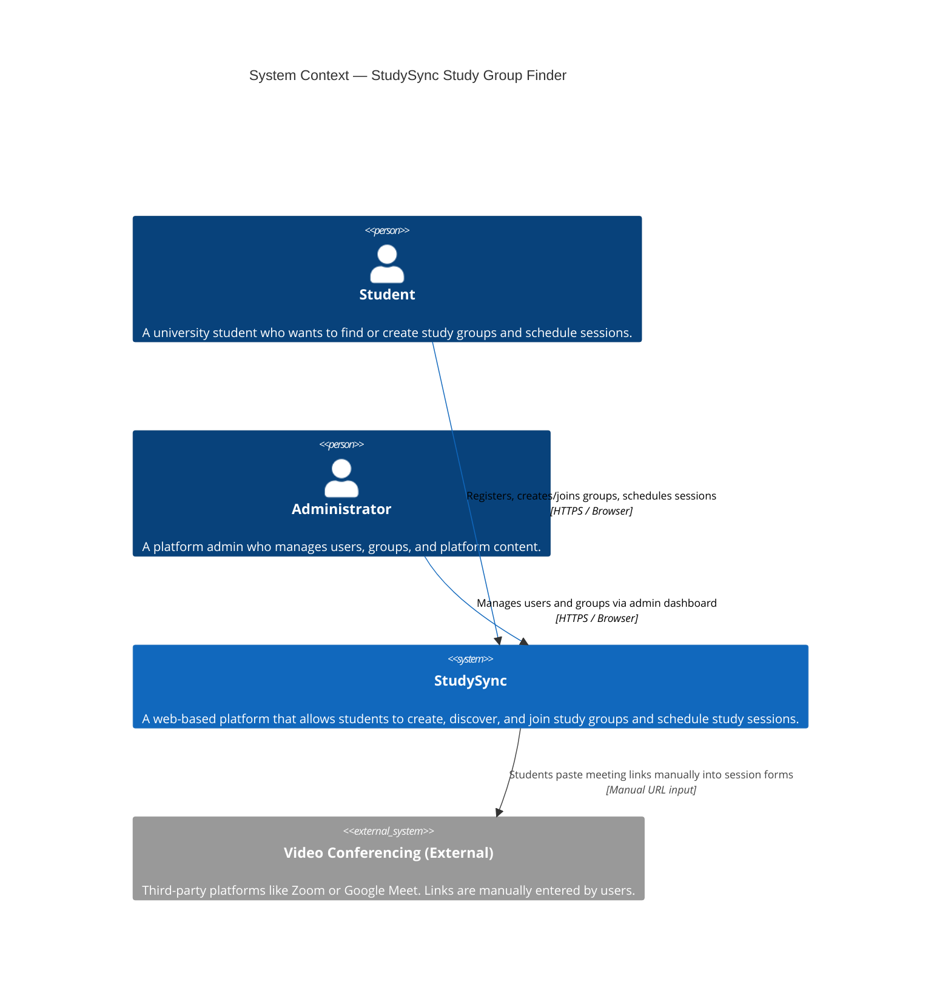
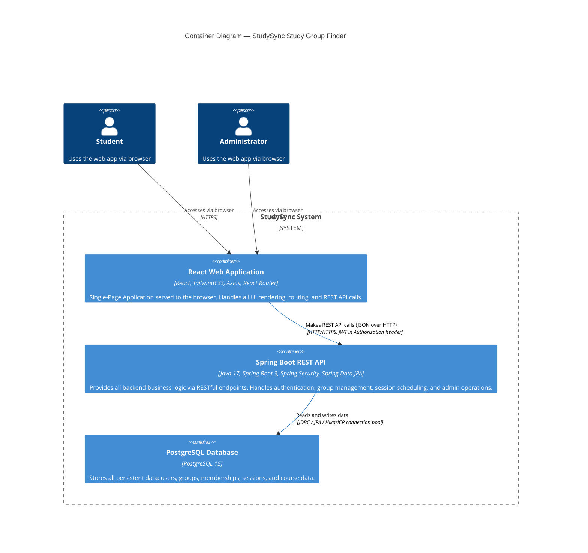
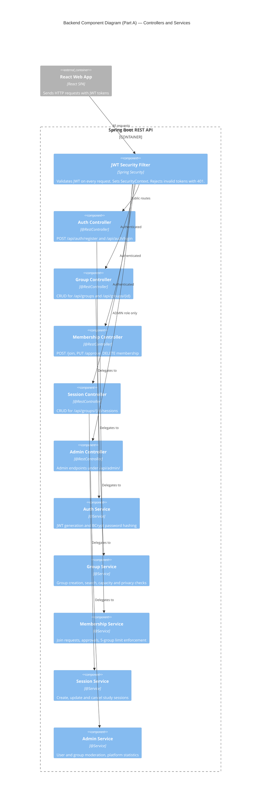
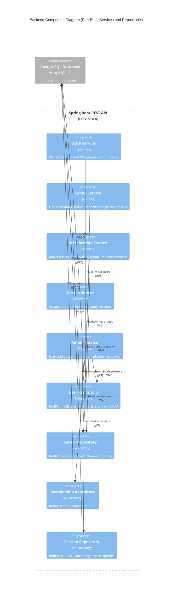
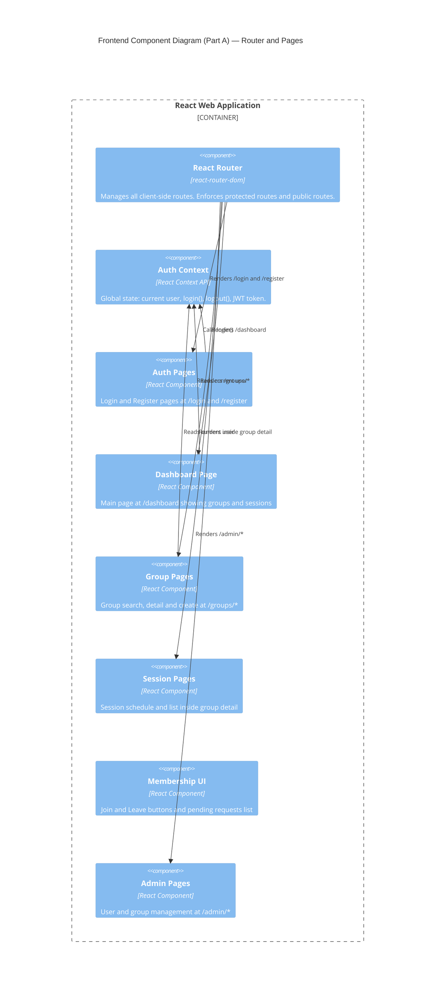
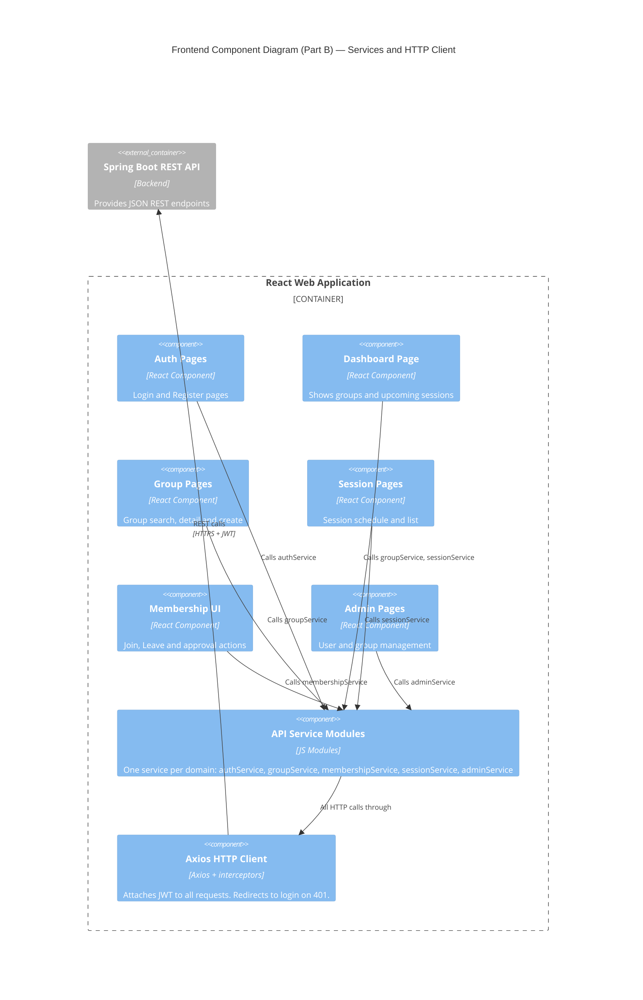
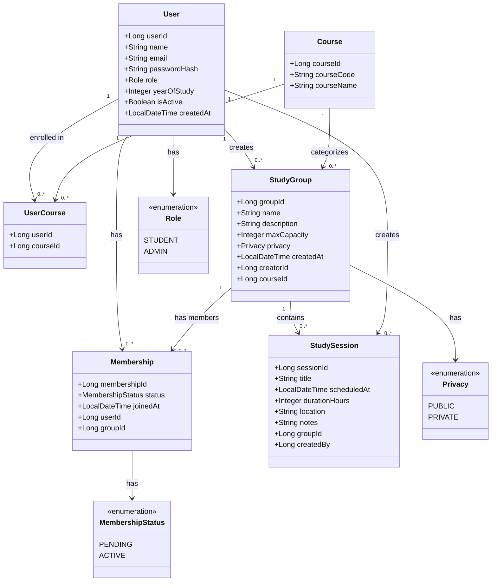

# ARCHITECTURE.md — StudySync: Study Group Finder System

---

## 1. Project Title
**StudySync — Study Group Finder System**

## 2. Domain
**Education / Academic Collaboration**

University-level peer study coordination. The platform sits at the intersection of student social networking and academic scheduling, enabling self-organized study groups within an institutional course context.

## 3. Problem Statement
Students lack a centralized platform to discover, create, and coordinate study groups by course. StudySync provides a structured web application that handles group formation, membership management, session scheduling, and admin oversight.

## 4. Individual Scope
The system is scoped to a single developer over one semester. It includes 5 features: authentication, group creation/discovery, membership management, session scheduling, and an admin dashboard — all implementable with React and Spring Boot.

---

## 5. C4 Architectural Diagrams

The C4 model describes a software system at four levels of abstraction:
- **Level 1 — System Context**: The system and its external users/dependencies
- **Level 2 — Container**: The deployable units (apps, databases, etc.)
- **Level 3 — Component**: The internal building blocks within each container
- **Level 4 — Code**: Key class/entity relationships (data model)

---

### Level 1 — System Context Diagram

> Shows StudySync and how it relates to its users and any external systems.



---

### Level 2 — Container Diagram

> Shows the deployable containers that make up StudySync and how they communicate.



---

### Level 3 — Component Diagram (Backend: Spring Boot API)

> Shows the internal components of the Spring Boot REST API container.

**Part A — Security, Controllers & Services**



**Part B — Services & Repositories**



---

### Level 3 — Component Diagram (Frontend: React Web Application)

> Shows the internal structure of the React SPA.

**Part A — Routing, Auth Context & Pages**



**Part B — Pages, API Services & Axios**


```

---

### Level 4 — Code Diagram (Core Data Model / Entity Relationships)

> Shows the key JPA entities and their relationships in the backend. This maps directly to the PostgreSQL schema.



---

## 6. End-to-End Request Flow Examples

### Flow 1: Student Joins a Public Group

```
Browser (React)
  → clicks "Join Group"
  → GroupPages component calls membershipService.join(groupId)
  → axiosClient sends POST /api/groups/{id}/join  [JWT attached]
  → JWT Security Filter validates token → sets SecurityContext
  → MembershipController.joinGroup() called
  → MembershipService checks: group exists? user not already member? under 5-group limit?
  → Creates Membership record (status=ACTIVE for public groups)
  → Returns 201 Created with membership DTO
  → React UI updates member count and shows "Leave Group" button
```

### Flow 2: Group Creator Approves a Join Request (Private Group)

```
Browser (React)
  → Group creator opens join requests panel
  → membershipService.approve(membershipId) called
  → axiosClient sends PUT /api/memberships/{id}/approve  [JWT attached]
  → MembershipController.approveMembership() called
  → MembershipService verifies caller is the group creator
  → Updates Membership status: PENDING → ACTIVE
  → Returns 200 OK
  → Creator UI removes request from pending list
```

### Flow 3: Session Scheduled

```
Browser (React)
  → Group member fills in session form, submits
  → sessionService.create(groupId, sessionData) called
  → POST /api/groups/{id}/sessions  [JWT attached]
  → SessionController.createSession() called
  → SessionService creates StudySession record
  → Returns 201 Created
  → Session appears in the group's session list for all members on next page load
```

---

## 7. Deployment Architecture (Vercel + Railway)

```
┌─────────────────────────────────────────────────────┐
│                  Internet (HTTPS)                   │
│                                                     │
│  ┌──────────────────┐      ┌─────────────────────┐  │
│  │   Vercel         │      │   Railway           │  │
│  │   React App      │────▶│   Spring Boot API    │  │
│  │   (Free Tier)    │      │   Port: 8080        │  │
│  └──────────────────┘      └──────────┬──────────┘  │
│                                        │            │
│                             ┌──────────▼──────────┐ │
│                             │   Railway           │ │
│                             │   PostgreSQL DB     │ │
│                             │   (Plugin)          │ │
│                             └─────────────────────┘ │
└─────────────────────────────────────────────────────┘
```

- **Vercel**: Hosts the React frontend. Connect your GitHub repo and it auto-deploys on every `git push`.
- **Railway (API)**: Hosts the Spring Boot JAR. Detects Java automatically from your GitHub repo.
- **Railway (Database)**: Add a PostgreSQL plugin to your Railway project. Provides a `DATABASE_URL` connection string that Spring Boot reads automatically via `application.properties`.
