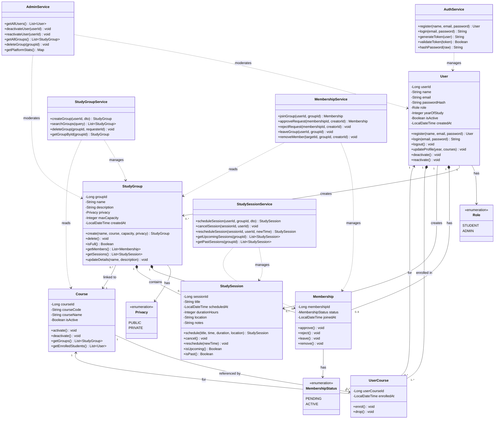

# CLASS_DIAGRAM.md — Class Diagram in Mermaid.js
## StudySync: Study Group Finder System

---

## 1. Class Diagram

---

## 2. Key Design Decisions

### 2.1 Composition vs Association

**Membership is a composition of both User and StudyGroup.** When a StudyGroup is deleted, all its Membership records are deleted with it (cascade). Similarly, when a User is deleted, their Membership records are removed. This is modelled as composition (`*--`) rather than a simple association because Membership has no meaningful existence outside of the User-Group relationship.

**StudySession is a composition of StudyGroup.** A session cannot exist without a group. If the group is deleted, all its sessions are cascade-deleted. However, the relationship to the creating User is an association — the session remains valid even if the creator later leaves the group.

**UserCourse is a composition of User.** Enrolment records are tied to the user's lifecycle. Deleting a user removes all their enrolments.

### 2.2 Services as Separate Classes

The service classes (AuthService, StudyGroupService, MembershipService, StudySessionService, AdminService) are included in the diagram as separate classes rather than embedding business logic inside the domain entities. This reflects the **Spring Boot layered architecture** defined in ARCHITECTURE.md — domain entities are pure data carriers (JPA entities) and services hold the business logic. This separation is shown using dependency arrows (`..>`) rather than associations.

### 2.3 Enumerations

Three enumerations are defined as separate classes with the `<<enumeration>>` stereotype:
- **Role** — controls endpoint access (STUDENT vs ADMIN)
- **Privacy** — controls group join behaviour (PUBLIC vs PRIVATE)
- **MembershipStatus** — tracks the approval state of a membership (PENDING vs ACTIVE)

Using enumerations rather than String fields enforces type safety at the database level (PostgreSQL ENUM types) and prevents invalid state values.

### 2.4 Multiplicity Choices

| Relationship | Multiplicity | Reasoning |
|---|---|---|
| User → Membership | 0..5 | Business rule BR-01 — max 5 active groups |
| User → UserCourse | 1..* | Business rule BR-05 — at least one course required |
| StudyGroup → Membership | 0..* | A group can exist with just the creator (1 member) |
| StudyGroup → Course | many to 1 | Every group must have exactly one course |
| StudyGroup → StudySession | 0..* | A group may have no sessions scheduled yet |

### 2.5 Traceability to Prior Assignments

| Design Decision | Traced To |
|---|---|
| User.role drives access control | NFR-SE3 (authorisation), FR-11, FR-12 |
| Membership.status = PENDING for private groups | FR-07 (join request flow), UC-07 |
| StudySession.scheduledAt guard (30 mins) | FR-09 acceptance criteria, US-010 |
| Cascade delete on group | FR-12 acceptance criteria (no orphan records) |
| Max 5 memberships per user | FR-06 acceptance criteria, US-007 |
| BCrypt in AuthService.hashPassword() | NFR-SE1, US-018 |
