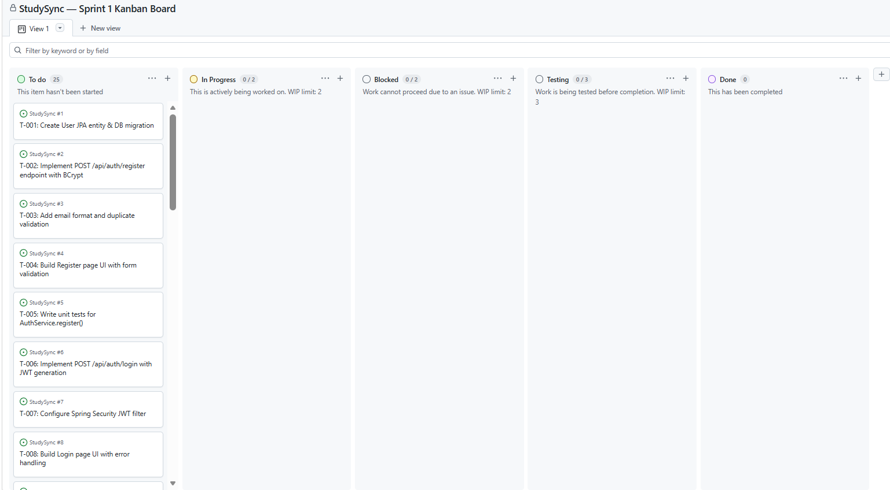

# StudySync — Study Group Finder System

## Introduction

**StudySync** is a web-based platform designed to help university students discover, create, and collaborate in study groups organised by course, subject, or topic. Students often struggle to find peers studying the same material at the same time — StudySync solves this by providing a centralised matchmaking environment for academic collaboration.

Once completed, StudySync will allow students to:
- Register and build an academic profile tied to their enrolled courses
- Create or join study groups by course code or subject area
- Schedule study sessions with date, time, location (physical or virtual), and session notes
- Send and receive join requests with approval workflows
- Allow administrators to manage users, groups, and platform content

The system will be built using a **React** frontend and a **Java Spring Boot** REST API backend, backed by a **PostgreSQL** relational database.

---

## Project Documents

### Assignment 3 — System Specification and Architectural Modeling
| Document | Description |
|---|---|
| [SPECIFICATION.md](./SPECIFICATION.md) | Full system specification including domain, problem statement, stakeholders, functional & non-functional requirements, and use cases |
| [ARCHITECTURE.md](./ARCHITECTURE.md) | C4 architectural diagrams (Context, Container, Component, and Code levels) with full end-to-end system coverage |

### Assignment 4 — Stakeholder and System Requirements Documentation
| Document | Description |
|---|---|
| [STAKEHOLDERS.md](./STAKEHOLDERS.md) | Detailed stakeholder analysis including roles, key concerns, pain points, and success metrics for 7 stakeholders |
| [SRD.md](./SRD.md) | Full System Requirements Document with 12 functional requirements and 10 non-functional requirements across 6 quality categories |
| [REFLECTION.md](./REFLECTION.md) | Cumulative reflections across all assignments — stakeholder trade-offs, Agile challenges, and Kanban template selection |

### Assignment 5 — Use Case Diagrams, Specifications and Test Cases
| Document | Description |
|---|---|
| [USE_CASES.md](./USE_CASES.md) | UML use case diagram, 8 detailed use case specifications, 15 functional test cases, 8 non-functional test cases, and a reflection on the process |

### Assignment 6 — Agile User Stories, Backlog and Sprint Planning
| Document | Description |
|---|---|
| [AGILE_PLANNING.md](./AGILE_PLANNING.md) | 20 user stories mapped to FRs and UCs, MoSCoW prioritised product backlog, Sprint 1 plan with 25 tasks, GitHub project setup guide, and Agile reflection |

### Assignment 7 — GitHub Project Templates and Kanban Board
| Document | Description |
|---|---|
| [TEMPLATE_ANALYSIS.md](./TEMPLATE_ANALYSIS.md) | Comparison of 4 GitHub project templates, selection of Automated Kanban, and justification for custom Blocked and Testing columns |
| [KANBAN_EXPLANATION.md](./KANBAN_EXPLANATION.md) | Definition of Kanban, explanation of all 5 board columns, WIP limits, workflow visualisation, and Agile alignment |
| [REFLECTION.md](./REFLECTION.md) | Updated with Assignment 7 reflection — template selection challenges, GitHub vs Trello vs Jira comparison, WIP limit limitations |

### Assignment 8 — Object State Modeling and Activity Workflow Modeling
| Document | Description |
|---|---|
| [STATE_DIAGRAMS.md](./STATE_DIAGRAMS.md) | State transition diagrams for 8 critical objects: User Account, Academic Profile, Study Group, Membership, Join Request, Study Session, Admin Moderation, Course Enrolment |
| [ACTIVITY_DIAGRAMS.md](./ACTIVITY_DIAGRAMS.md) | Activity workflow diagrams for 8 workflows: Registration, Login, Create Group, Search and Join, Private Join Request, Schedule Session, Admin Moderation, Edit Profile |
| [REFLECTION.md](./REFLECTION.md) | Updated with Assignment 8 reflection — granularity challenges, aligning diagrams with user stories, state vs activity diagrams, and Mermaid parallel action limitations |

---

## Kanban Board

The StudySync project is managed using a **GitHub Projects Kanban board** based on the Automated Kanban template, customised with two additional columns to support a complete development workflow.

**🔗 Live Board:** [StudySync Sprint 1 Kanban Board](https://github.com/users/Keitudimps/projects/2/views/1)

### Screenshot

### Board Columns

| Column | Type | WIP Limit | Purpose |
|---|---|---|---|
| **To Do** | Default | None | All sprint tasks not yet started. Populated at the start of each sprint. |
| **In Progress** | Default | 3 | Tasks actively being developed. Auto-moves when a linked issue is opened. |
| **Blocked** | Custom | 2 | Tasks that cannot proceed due to a dependency or blocker. Makes blockers visible instead of hiding them inside In Progress. |
| **Testing** | Custom | 3 | Code-complete tasks awaiting manual verification before Done. Enforces the quality gate. |
| **Done** | Default | None | Fully verified tasks that meet the Definition of Done. Auto-moves when a linked issue is closed. |

### Customisation Choices

**"Blocked" column added** — without it, stuck tasks are invisible inside In Progress. A WIP limit of 2 creates urgency to resolve blockers rather than let them accumulate silently.

**"Testing" column added** — the default template moves issues straight from In Progress to Done when closed, skipping verification entirely. This column enforces the Definition of Done defined in AGILE_PLANNING.md.

**Automated Kanban chosen over Basic Kanban** — automation keeps the board accurate without constant manual card movement, which is essential for a solo developer managing 25 tasks across a 2-week sprint.

### Labels Used

| Label | Applied To |
|---|---|
| `sprint-1` | All Sprint 1 issues |
| `must-have` | MoSCoW Must-have stories |
| `should-have` | MoSCoW Should-have stories |
| `backend` | Spring Boot tasks |
| `frontend` | React tasks |
| `security` | Authentication and encryption tasks |
| `database` | JPA entity and migration tasks |
| `testing` | Verification and test tasks |

---

## Tech Stack (Planned)

| Layer | Technology |
|---|---|
| Frontend | React, Axios, React Router, TailwindCSS |
| Backend | Java Spring Boot, Spring Security, Spring Data JPA |
| Database | PostgreSQL |
| Authentication | JWT (JSON Web Tokens) |
| Deployment | Vercel (Frontend), Railway (Backend + Database) |
| API Style | RESTful |

---

## Author

**Fereshteh Keitumetse Gomolemo Dimpe**  
Student Number: 221806229  
Course: Software Engineering  
Assignments 3–7 — System Specification, Architecture, Requirements, Use Cases, Agile Planning and Kanban Board  

