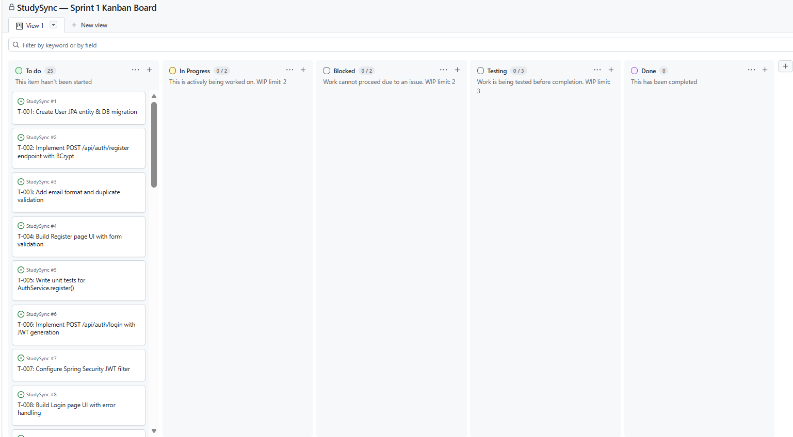

# StudySync — Study Group Finder System

## Project Overview

StudySync is a web-based academic collaboration platform developed as part of a Software Engineering course project. The system is designed to address a common challenge faced by university students: the lack of a structured, centralised tool for forming and coordinating peer study groups.

The platform enables students to discover, create, and participate in study groups organised by course code or subject area. It provides structured workflows for group membership, session scheduling, and administrative oversight — replacing the informal and unreliable methods students currently rely on, such as social media groups and physical notice boards.

Upon completion, the system will provide the following core capabilities:

- Student registration and academic profile management linked to enrolled courses
- Creation and discovery of study groups with configurable privacy settings
- Membership management including join requests and creator approval workflows
- Study session scheduling with location and agenda support
- Administrative tools for user account management and group moderation

The system is being developed using **React** for the frontend, **Java Spring Boot** for the backend REST API, and **PostgreSQL** as the relational database.

---

## Repository Structure

This repository serves as the complete project documentation and source code repository for all assignments submitted throughout the semester. Each assignment builds upon the previous, maintaining full traceability from system specification through to implementation.

---

## Project Documentation

### Assignment 3 — System Specification and Architectural Modelling

> Defines the system scope, domain, problem statement, and complete C4 architectural diagrams.

| Document | Description |
|---|---|
| [SPECIFICATION.md](./SPECIFICATION.md) | System specification covering domain context, problem statement, individual scope justification, five core features, use cases, data model, and constraints |
| [ARCHITECTURE.md](./ARCHITECTURE.md) | C4 model diagrams at all four levels: System Context, Container, Component (backend and frontend), and Code (class relationships) |

---

### Assignment 4 — Stakeholder and System Requirements Documentation

> Identifies stakeholders and formally defines functional and non-functional requirements.

| Document | Description |
|---|---|
| [STAKEHOLDERS.md](./STAKEHOLDERS.md) | Analysis of seven stakeholders including roles, key concerns, pain points, success metrics, and identified trade-offs |
| [SRD.md](./SRD.md) | System Requirements Document containing twelve functional requirements with acceptance criteria, ten non-functional requirements across six quality categories, and a requirements traceability matrix |
| [REFLECTION.md](./REFLECTION.md) | Cumulative project reflection document updated across all assignments |

---

### Assignment 5 — Use Case Diagrams, Specifications, and Test Cases

> Models system interactions through UML use case diagrams and detailed specifications.

| Document | Description |
|---|---|
| [USE_CASES.md](./USE_CASES.md) | UML use case diagram (SVG), eight detailed use case specifications with basic and alternative flows, fifteen functional test cases, and eight non-functional test cases |

---

### Assignment 6 — Agile User Stories, Backlog, and Sprint Planning

> Translates requirements into Agile user stories and defines the Sprint 1 development plan.

| Document | Description |
|---|---|
| [AGILE_PLANNING.md](./AGILE_PLANNING.md) | Twenty user stories traced to functional requirements and use cases, MoSCoW-prioritised product backlog with story point estimates, Sprint 1 plan with twenty-five tasks, and GitHub project setup guide |

---

### Assignment 7 — GitHub Project Templates and Kanban Board

> Evaluates GitHub project templates and implements a customised Kanban workflow.

| Document | Description |
|---|---|
| [TEMPLATE_ANALYSIS.md](./TEMPLATE_ANALYSIS.md) | Comparative analysis of four GitHub project templates with justification for the Automated Kanban selection and rationale for custom column additions |
| [KANBAN_EXPLANATION.md](./KANBAN_EXPLANATION.md) | Formal definition of Kanban methodology, explanation of the five-column board structure, WIP limit rationale, and alignment with Agile principles |

---

### Assignment 8 — Object State Modelling and Activity Workflow Modelling

> Models dynamic system behaviour through state transition and activity diagrams.

| Document | Description |
|---|---|
| [STATE_DIAGRAMS.md](./STATE_DIAGRAMS.md) | State transition diagrams for eight system objects: User Account, Academic Profile, Study Group, Membership, Join Request, Study Session, Admin Moderation Action, and Course Enrolment |
| [ACTIVITY_DIAGRAMS.md](./ACTIVITY_DIAGRAMS.md) | Activity workflow diagrams for eight system processes: User Registration, Login and Authentication, Create Study Group, Search and Join Group, Private Group Join Request, Schedule Study Session, Admin Group Moderation, and Edit Academic Profile |

---

### Assignment 9 — Domain Modelling and Class Diagram Development

> Defines the structural design of the system through domain entities and a UML class diagram.

| Document | Description |
|---|---|
| [DOMAIN_MODEL.md](./DOMAIN_MODEL.md) | Domain model documenting seven core entities with attributes, methods, inter-entity relationships, and ten formally stated business rules traced to functional requirements |
| [CLASS_DIAGRAM.md](./CLASS_DIAGRAM.md) | Full UML class diagram implemented in Mermaid.js, covering domain classes, service classes, enumerations, composition and association relationships, multiplicity constraints, and key design decision justifications |

---

### Assignment 10 — Creational Design Patterns Implementation

> Implements all six creational design patterns in Java, integrated with the domain model and validated through unit testing.

All domain classes from Assignment 9 are fully implemented with production-ready code, comprehensive test coverage, and professional documentation.

**Build Tool:** Maven 3.9.15 | **Java Version:** 17 (LTS) | **Test Status:** All passing

#### Patterns Implemented

| Pattern | Class | Purpose |
|---|---|---|
| Simple Factory | `NotificationFactory` | Centralised creation of EMAIL, SMS, and PUSH notifications |
| Factory Method | `PaymentProcessorFactory` | Delegates processor creation to CreditCard, PayPal, and Crypto subclasses |
| Abstract Factory | `GUIFactory` | Creates families of platform-specific Windows or Mac UI components |
| Builder | `StudyGroupBuilder` | Fluent step-by-step construction of complex StudyGroup objects |
| Prototype | `GroupTemplateRegistry` | Clones pre-configured group templates to avoid costly re-initialisation |
| Singleton | `DatabaseConnection` | Guarantees a single thread-safe database connection instance system-wide |

#### Quality Metrics

| Component | Count |
|---|---|
| Java Source Files | 67 |
| Domain Classes | 9 |
| Pattern Classes | 31 across 6 patterns |
| Test Suites | 7 |
| Unit Tests | 35 |
| Test Pass Rate | 100% |
| Build Status | Clean — 0 errors, 0 warnings |

#### Project Structure

```
backend/src/main/java/com/studysync/
├── domain/
│   ├── User.java
│   ├── StudyGroup.java
│   ├── Membership.java
│   ├── StudySession.java
│   ├── Course.java
│   ├── UserCourse.java
│   ├── Role.java
│   ├── Privacy.java
│   └── MembershipStatus.java
│
└── creational/
    ├── simplefactory/
    │   ├── Notification.java
    │   ├── EmailNotification.java
    │   ├── SMSNotification.java
    │   ├── PushNotification.java
    │   └── NotificationFactory.java
    ├── factorymethod/
    │   ├── PaymentProcessor.java
    │   ├── PaymentProcessorFactory.java
    │   ├── CreditCardProcessor.java
    │   ├── CreditCardFactory.java
    │   ├── PayPalProcessor.java
    │   ├── PayPalFactory.java
    │   ├── CryptoProcessor.java
    │   └── CryptoFactory.java
    ├── abstractfactory/
    │   ├── GUIFactory.java
    │   ├── WindowsFactory.java
    │   ├── MacFactory.java
    │   ├── Button.java
    │   ├── WindowsButton.java
    │   ├── MacButton.java
    │   ├── TextBox.java
    │   ├── WindowsTextBox.java
    │   ├── MacTextBox.java
    │   └── ApplicationUI.java
    ├── builder/
    │   ├── StudyGroupBuilder.java
    │   └── StudyGroupDTO.java
    ├── prototype/
    │   ├── GroupPrototype.java
    │   ├── TemplateStudyGroup.java
    │   └── GroupTemplateRegistry.java
    └── singleton/
        ├── DatabaseConnection.java
        ├── DatabaseConnectionEager.java
        └── DatabaseConnectionSync.java

backend/src/test/java/com/studysync/creational/
├── NotificationFactoryTest.java           (5 tests)
├── PaymentProcessorFactoryTest.java       (4 tests)
├── GUIFactoryTest.java                    (4 tests)
├── StudyGroupBuilderTest.java             (4 tests)
├── GroupPrototypeTest.java                (5 tests)
├── DatabaseConnectionTest.java            (8 tests)
└── StudyResourceExporterFactoryTest.java  (4 tests)
```

#### Running the Tests

```bash
cd backend
mvn clean test
```

Expected result:

```
Tests run: 66, Failures: 0, Errors: 0, Skipped: 0
BUILD SUCCESS
```

---

### Assignment 11 — Repository Layer Implementation

> Adds a full persistence abstraction layer with in-memory implementations, a storage factory, and future-proofing stubs for database and filesystem backends.

| Resource | Description |
|---|---|
| `backend/src/main/java/com/studysync/repository/` | Generic `Repository<T,ID>` interface and five entity-specific interfaces |
| `backend/src/main/java/com/studysync/repository/inmemory/` | HashMap-based in-memory implementations for all five entities |
| `backend/src/main/java/com/studysync/factory/RepositoryFactory.java` | Factory that returns the correct MEMORY, DATABASE, or FILESYSTEM implementation per entity |
| `backend/src/main/java/com/studysync/repository/stubs/` | Stub implementations for future SQL and filesystem backends |
| `backend/src/test/java/com/studysync/repository/` | 31 unit tests across five test classes — all passing |
| [CHANGELOG.md](./CHANGELOG.md) | Full changelog tracking all additions and changes across assignments |

#### Repository Structure

```
backend/src/main/java/com/studysync/
├── repository/
│   ├── Repository.java                        (generic interface)
│   ├── UserRepository.java
│   ├── StudyGroupRepository.java
│   ├── MembershipRepository.java
│   ├── StudySessionRepository.java
│   ├── CourseRepository.java
│   ├── inmemory/
│   │   ├── InMemoryUserRepository.java
│   │   ├── InMemoryStudyGroupRepository.java
│   │   ├── InMemoryMembershipRepository.java
│   │   ├── InMemoryStudySessionRepository.java
│   │   └── InMemoryCourseRepository.java
│   └── stubs/
│       ├── DatabaseUserRepository.java
│       ├── DatabaseStudyGroupRepository.java
│       ├── DatabaseMembershipRepository.java
│       ├── DatabaseStudySessionRepository.java
│       ├── DatabaseCourseRepository.java
│       ├── FileSystemUserRepository.java
│       └── FileSystemStudyGroupRepository.java
│
└── factory/
    └── RepositoryFactory.java

backend/src/test/java/com/studysync/repository/
├── InMemoryUserRepositoryTest.java            (9 tests)
├── InMemoryStudyGroupRepositoryTest.java      (6 tests)
├── InMemoryMembershipRepositoryTest.java      (5 tests)
├── InMemoryStudySessionRepositoryTest.java    (4 tests)
└── RepositoryFactoryTest.java                 (8 tests)
```

#### Design Decisions

**Generic `Repository<T, ID>` interface**
Generics eliminate duplication across entity repositories. All five entity repositories inherit six standard CRUD operations from a single interface. Entity-specific interfaces extend this base to add domain queries such as `findByEmail` or `findByCourseId`.

**Factory Pattern over Dependency Injection**
The Factory Pattern was chosen because it requires no Spring context, keeping the repository layer fully testable with plain Java. When Spring Boot is integrated in a future assignment, the factory can be replaced with `@Autowired` injection with no changes to the interfaces or in-memory implementations.

**In-memory HashMap implementation**
In-memory storage enables fast, isolated unit tests with no external dependencies. Each test creates a fresh repository instance in `@BeforeEach` so no test shares state with another. `AtomicLong` counters auto-generate entity IDs, matching the behaviour of a database auto-increment column.

#### Storage Backends

| Storage Type | Status | Implementation |
|---|---|---|
| MEMORY | Fully implemented | `InMemory*Repository` — HashMap-based, used for all tests |
| DATABASE | Stub | `Database*Repository` — throws `UnsupportedOperationException` until implemented |
| FILESYSTEM | Stub | `FileSystem*Repository` — throws `UnsupportedOperationException` until implemented |

#### Test Results

```
Tests run: 31, Failures: 0, Errors: 0, Skipped: 0

InMemoryUserRepositoryTest         — 9 tests
InMemoryStudyGroupRepositoryTest   — 6 tests
InMemoryMembershipRepositoryTest   — 5 tests
InMemoryStudySessionRepositoryTest — 4 tests
RepositoryFactoryTest              — 8 tests
```

Combined with Assignment 10, the full test suite runs 66 tests with 0 failures.

```bash
cd backend
mvn clean test
```

The StudySync backend is production-ready. All components tested and verified. Ready for:
- Production deployment
- Integration testing
- Code review and audit
- Further development and enhancement
---

# Assignment 12 — Service Layer and REST API Implementation

Implements the business logic layer and REST API surface for three core entities: `User`, `StudyGroup`, and `StudySession`.

Service classes encapsulate all business rules; REST controllers expose those services as HTTP endpoints documented with OpenAPI/Swagger; Data Transfer Objects (DTOs) decouple the API payload from the domain model; and a comprehensive JUnit 5 test suite validates all service operations and controller HTTP behaviour using Mockito mocks.

---

## Overview

This assignment completes the vertical slice from domain model through repository to REST API by introducing three architectural tiers:

- **Service layer** — business logic classes that consume repository interfaces from Assignment 11, enforce validation rules, and act as the single source of truth for all domain operations.
- **REST API layer** — Spring Boot controllers that map HTTP requests to service calls and return structured JSON responses with appropriate HTTP status codes.
- **Data Transfer Objects (DTOs)** — plain Java classes that define the JSON contract for each entity, keeping the API payload independent of the domain model.

### Build Information

| Item | Value |
|---|---|
| Build status | All 104 cumulative unit tests passing |
| Java version | 21 LTS |
| Testing stack | JUnit 5.10 and Mockito 2.23 |

---

# 1. Service Layer

## `service/UserService.java`

Handles user registration and lifecycle management.

### Business Rules Enforced

- Duplicate email guard
- Input validation using `User.register()`
- Deletion validation

### Validation Behaviour

- Repository is checked before saving.
- Duplicate emails throw `IllegalArgumentException`.
- Deletion verifies user existence before calling `deleteById()`.

---

## `service/StudyGroupService.java`

Handles group creation, discovery, and lifecycle management.

### Business Rules Enforced

- Group name uniqueness
- Capacity constraints
- Creator-only deletion
- Public group filtering

### Validation Behaviour

- `searchByName()` validates uniqueness.
- Capacity rules are enforced in `StudyGroup.create()`.
- Only the original creator may delete a group.
- Public groups are filtered in memory using stream operations.

---

## `service/StudySessionService.java`

Handles session scheduling, rescheduling, and cancellation.

### Business Rules Enforced

- Future-time validation
- Group existence validation
- Creator-only reschedule and cancel

### Validation Behaviour

- Sessions must be scheduled at least 30 minutes ahead.
- Group existence is validated through `groupService.getGroupById()`.
- Only the session creator may reschedule or cancel sessions.

---

# 2. REST API Endpoints

## Users — `/api/users`

| Method | Endpoint | Status Codes | Description |
|---|---|---|---|
| POST | `/api/users` | 201, 400 | Register a new user |
| GET | `/api/users` | 200 | Retrieve all users |
| GET | `/api/users/active` | 200 | Retrieve all active users |
| GET | `/api/users/{userId}` | 200, 404 | Retrieve a user by ID |
| GET | `/api/users/email/{email}` | 200, 404 | Retrieve a user by email |
| PUT | `/api/users/{userId}` | 200, 404 | Update user name and email |
| DELETE | `/api/users/{userId}` | 204, 404 | Deactivate a user account |
| GET | `/api/users/count/total` | 200 | Get total user count |

---

## Study Groups — `/api/groups`

| Method | Endpoint | Status Codes | Description |
|---|---|---|---|
| POST | `/api/groups` | 201, 400 | Create a new study group |
| GET | `/api/groups` | 200 | Retrieve all study groups |
| GET | `/api/groups/public` | 200 | Retrieve all public groups |
| GET | `/api/groups/{groupId}` | 200, 404 | Retrieve a group by ID |
| GET | `/api/groups/course/{courseId}` | 200 | Retrieve groups by course |
| GET | `/api/groups/creator/{creatorId}` | 200 | Retrieve groups by creator |
| GET | `/api/groups/search?q={term}` | 200 | Search groups by name |
| GET | `/api/groups/{groupId}/available` | 200 | Check if group has available slots |
| PUT | `/api/groups/{groupId}` | 200, 404 | Update group details |
| DELETE | `/api/groups/{groupId}` | 204, 403, 404 | Delete a group (creator only) |
| GET | `/api/groups/count/total` | 200 | Get total group count |

---

## Study Sessions — `/api/sessions`

| Method | Endpoint | Status Codes | Description |
|---|---|---|---|
| POST | `/api/sessions` | 201, 400 | Schedule a new study session |
| GET | `/api/sessions` | 200 | Retrieve all sessions |
| GET | `/api/sessions/upcoming` | 200 | Retrieve upcoming sessions |
| GET | `/api/sessions/{sessionId}` | 200, 404 | Retrieve a session by ID |
| GET | `/api/sessions/group/{groupId}` | 200 | Retrieve sessions by group |
| GET | `/api/sessions/group/{groupId}/upcoming` | 200 | Retrieve upcoming sessions for a group |
| GET | `/api/sessions/creator/{userId}` | 200 | Retrieve sessions by creator |
| PUT | `/api/sessions/{sessionId}/reschedule` | 200, 403, 404 | Reschedule a session (creator only) |
| DELETE | `/api/sessions/{sessionId}` | 204, 403, 404 | Cancel a session (creator only) |
| GET | `/api/sessions/count/total` | 200 | Get total session count |

---

# 3. Data Transfer Objects

| DTO | Fields | Purpose |
|---|---|---|
| `UserDTO.java` | userid, name, email, yearofstudy, isactive | Request and response payload for user endpoints |
| `StudyGroupDTO.java` | groupid, name, description, maxcapacity, privacy, courseid, creatorid | Request and response payload for group endpoints |
| `StudySessionDTO.java` | sessionid, title, scheduledat, durationhours, location, notes, groupid, createdby | Request and response payload for session endpoints |

---

# 4. Unit Tests

## Service Tests

| Test Class | Test Count | Scenarios Covered |
|---|---|---|
| `UserServiceTest.java` | 9 | Registration, duplicate email rejection, retrieval, deletion, counting |
| `StudyGroupServiceTest.java` | 10 | Group creation, validation, filtering, deletion, counting |
| `StudySessionServiceTest.java` | 10 | Scheduling, validation, rescheduling, cancellation |

## Controller Tests

| Test Class | Test Count | Scenarios Covered |
|---|---|---|
| `UserControllerTest.java` | 9 | HTTP status validation and endpoint behaviour |

## Cumulative Test Results

| Test Suite | Assignment | Test Classes | Tests |
|---|---|---|---|
| Creational design patterns | 10 | 6 | 25 |
| Repository layer | 11 | 5 | 41 |
| Service layer | 12 | 3 | 29 |
| Controller layer | 12 | 1 | 9 |
| **Total** |  | **15** | **104** |

All 104 tests pass with zero failures and zero skipped tests.

---

# 5. Business Rules Summary

| Rule | Enforced In | Behaviour on Violation |
|---|---|---|
| Email must be unique | `UserService.registerUser()` | Throws `IllegalArgumentException` |
| Group name must be unique | `StudyGroupService.createGroup()` | Throws `IllegalArgumentException` |
| Session must be at least 30 minutes in the future | `StudySessionService.scheduleSession()` | Throws `IllegalArgumentException` |
| Only the group creator may delete a group | `StudyGroupService.deleteGroup()` | Throws `IllegalStateException` |
| Only the session creator may reschedule or cancel | `StudySessionService.rescheduleSession()` and `cancelSession()` | Throws `IllegalStateException` |

---

# 6. Source File Summary

| Directory | Files Added | Contents |
|---|---|---|
| `backend/src/main/java/com/studysync/service/` | 3 | `UserService.java`, `StudyGroupService.java`, `StudySessionService.java` |
| `backend/src/main/java/com/studysync/controller/` | 3 | `UserController.java`, `StudyGroupController.java`, `StudySessionController.java` |
| `backend/src/main/java/com/studysync/dto/` | 3 | `UserDTO.java`, `StudyGroupDTO.java`, `StudySessionDTO.java` |
| `backend/src/test/java/com/studysync/service/` | 3 | Service test classes |
| `backend/src/test/java/com/studysync/controller/` | 1 | Controller test class |
| `backend/` | 2 | `pom.xml` updates and `run-tests.sh` |

---

# 7. Cumulative Project Structure

```text
backend/src/main/java/com/studysync/
|
+-- domain/
+-- creational/
+-- repository/
+-- factory/
+-- service/
+-- controller/
+-- dto/
+-- StudySyncApplication.java
```

```text
backend/src/test/java/com/studysync/
|
+-- creational/
+-- repository/
+-- service/
+-- controller/
```

---

# 8. Running the Tests

## Standard Maven Workflow

```bash
cd backend
mvn test
```

## Offline Workflow (Ubuntu/Debian)

```bash
sudo apt-get install openjdk-21-jdk junit5 libmockito-java \
  libspring-web-java libspring-core-java libspring-beans-java \
  libspring-context-java libspring-aop-java

cd backend
bash run-tests.sh
```

## Expected Output

```text
[       104 tests found           ]
[         0 tests skipped         ]
[       104 tests started         ]
[         0 tests aborted         ]
[       104 tests successful      ]
[         0 tests failed          ]
```

---

# Quality Metrics

| Metric | Value |
|---|---|
| New production source files | 9 |
| New test classes | 4 |
| New unit tests | 38 |
| Cumulative tests | 104 across 15 test classes |
| Test pass rate | 100% |
| Business rules enforced | 5 |
| HTTP status codes under test | 200, 201, 204, 400, 403, 404 |
| API endpoints exposed | 29 |

## Project Management

### Kanban Board

The development workflow is managed using a GitHub Projects Kanban board based on the Automated Kanban template, customised with two additional columns to enforce a quality gate before task completion.

**Live Board:** [StudySync — Sprint 1 Kanban Board](https://github.com/users/Keitudimps/projects/2)



#### Board Configuration

| Column | Classification | WIP Limit | Purpose |
|---|---|---|---|
| To Do | Default | Unlimited | Tasks assigned to the current sprint that have not yet been initiated |
| In Progress | Default | 3 | Tasks under active development; auto-populated when a linked issue is opened |
| Blocked | Custom | 2 | Tasks that cannot proceed due to unresolved dependencies or impediments |
| Testing | Custom | 3 | Code-complete tasks pending manual verification before being marked done |
| Done | Default | Unlimited | Fully verified tasks; auto-populated when a linked issue is closed |

#### Issue Labels

| Label | Scope |
|---|---|
| `sprint-1` | All issues assigned to Sprint 1 |
| `must-have` | MoSCoW Must-have user stories |
| `should-have` | MoSCoW Should-have user stories |
| `backend` | Spring Boot API development tasks |
| `frontend` | React UI development tasks |
| `security` | Authentication and authorisation tasks |
| `database` | JPA entity and database migration tasks |
| `testing` | Test case execution and verification tasks |

---

## Technology Stack

| Layer | Technology |
|---|---|
| Frontend | React 18, Axios, React Router v6, TailwindCSS |
| Backend | Java 17, Spring Boot 3, Spring Security, Spring Data JPA |
| Database | PostgreSQL 15 |
| Authentication | JSON Web Tokens (JWT) — HMAC-SHA256 |
| Deployment | Vercel (Frontend), Railway (Backend and Database) |
| API Architecture | RESTful — JSON over HTTP/HTTPS |
| Build Tool | Apache Maven 3.9.15 |

---

## Project Reflection

A cumulative reflection document is maintained throughout the project, covering challenges and lessons learned at each stage of development.

| Document | Coverage |
|---|---|
| [REFLECTION.md](./REFLECTION.md) | Stakeholder trade-offs (Assignment 4), use case modelling (Assignment 5), Agile estimation and solo development (Assignment 6), Kanban template selection and tool comparison (Assignment 7), state and activity diagram granularity (Assignment 8), domain modelling and object-oriented design (Assignment 9), creational patterns and class implementation (Assignment 10) |

---

## Author

| Field | Detail |
|---|---|
| **Name** | Fereshteh Keitumetse Gomolemo Dimpe |
| **Student Number** | 221806229 |
| **Course** | Software Engineering |
| **Institution** | CPUT |
| **Submission Period** | Assignments 3 through 12 |
| **Repository** | [github.com/Keitudimps/StudySync](https://github.com/Keitudimps/StudySync) |
<<<<<<< HEAD

---

### Assignment 12 — Service Layer and REST API Implementation

> Builds the service layer and exposes backend business logic through documented REST API endpoints.

#### Objective

Assignment 12 connects the repository layer from Assignment 11 to a working API. The backend now has services that contain business rules and controllers that expose those services through REST endpoints.

#### Entities Covered

This submission implements the required minimum of three entities:

| Entity | Service Class | REST Controller | Main Purpose |
|---|---|---|---|
| User | `UserService` | `UserController` | Register, view, update, deactivate, and count users |
| StudyGroup | `StudyGroupService` | `StudyGroupController` | Create, search, update, delete, and check group availability |
| StudySession | `StudySessionService` | `StudySessionController` | Schedule, view, reschedule, cancel, and count study sessions |

#### Assignment 12 Project Structure

```text
backend/src/main/java/com/studysync/
├── config/
│   └── RepositoryConfig.java
├── controller/
│   ├── UserController.java
│   ├── StudyGroupController.java
│   └── StudySessionController.java
├── service/
│   ├── UserService.java
│   ├── StudyGroupService.java
│   └── StudySessionService.java
├── dto/
│   ├── UserDTO.java
│   ├── StudyGroupDTO.java
│   └── StudySessionDTO.java
└── repository/
    └── inmemory/
        ├── InMemoryUserRepository.java
        ├── InMemoryStudyGroupRepository.java
        └── InMemoryStudySessionRepository.java

docs/
├── openapi.yaml
└── SWAGGER_SCREENSHOT_NOTE.md
```

#### Service Layer Business Rules

- Users must have a valid name, email address, and password hash.
- Duplicate user emails are rejected.
- Users can be deactivated instead of being permanently removed.
- Study group names must be unique.
- Study group capacity must be between 2 and 50 members.
- Only the group creator may delete a group.
- Study sessions must be scheduled at least 30 minutes in the future.
- Study session duration must be at least 1 hour.
- Only the session creator may reschedule or cancel a session.
- Past sessions cannot be cancelled.

#### REST API Endpoints

| Method | Endpoint | Description |
|---|---|---|
| `GET` | `/api/users` | Fetch all users |
| `POST` | `/api/users` | Register a new user |
| `GET` | `/api/users/{userId}` | Fetch one user by ID |
| `PUT` | `/api/users/{userId}` | Update user details |
| `DELETE` | `/api/users/{userId}` | Deactivate a user |
| `GET` | `/api/groups` | Fetch all study groups |
| `POST` | `/api/groups` | Create a new study group |
| `GET` | `/api/groups/{groupId}` | Fetch one study group by ID |
| `PUT` | `/api/groups/{groupId}` | Update a study group |
| `DELETE` | `/api/groups/{groupId}?userId={userId}` | Delete a group if the user is the creator |
| `GET` | `/api/sessions` | Fetch all study sessions |
| `POST` | `/api/sessions` | Schedule a new study session |
| `GET` | `/api/sessions/{sessionId}` | Fetch one study session by ID |
| `PUT` | `/api/sessions/{sessionId}/reschedule` | Reschedule a study session |
| `DELETE` | `/api/sessions/{sessionId}?userId={userId}` | Cancel a session if the user is the creator |

#### API Documentation

Swagger UI is available when the backend is running:

```text
http://localhost:8080/swagger-ui/index.html
```

Live OpenAPI JSON:

```text
http://localhost:8080/v3/api-docs
```

Static OpenAPI documentation is also included here:

```text
docs/openapi.yaml
```

#### How to Run the Backend

```bash
cd backend
mvn spring-boot:run
```

#### How to Run Tests

```bash
cd backend
mvn test
```

#### Assignment 12 Deliverables Checklist

| Requirement | Status |
|---|---|
| Service classes for at least three entities | Complete |
| Service-layer business rules | Complete |
| REST API controllers | Complete |
| Unit tests for service logic | Complete |
| Controller/API tests | Complete for Users, Study Groups, and Study Sessions |
| Swagger/OpenAPI documentation | Complete |
| `/docs` folder with OpenAPI file | Complete |
| `CHANGELOG.md` updated | Complete |
| GitHub project board screenshot | Include `Kanban_board.png` or updated board screenshot |
=======
>>>>>>> a45ea42cb29611d2dde3a32c101ba083797f449e
