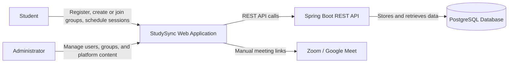
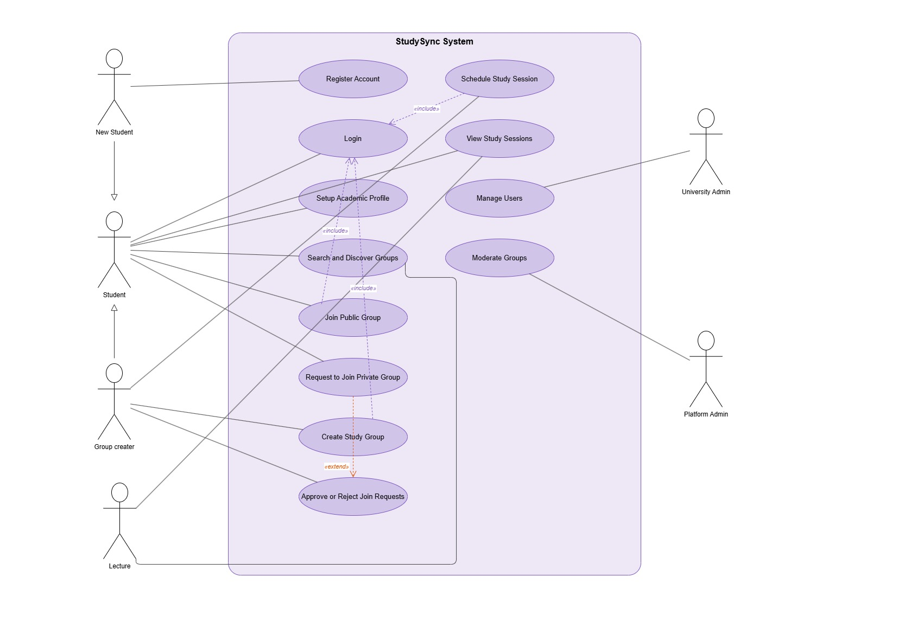
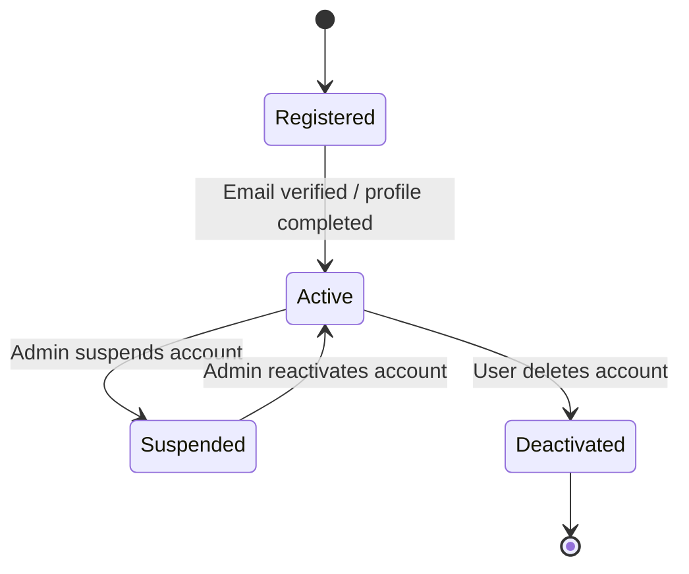
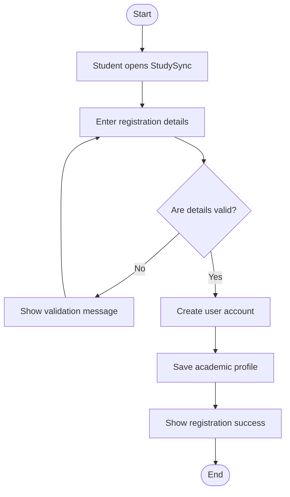
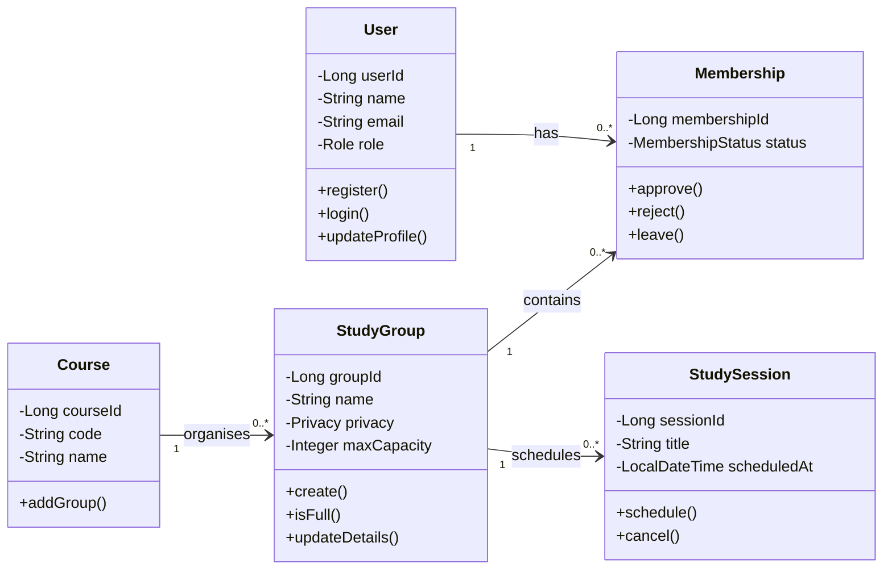

# StudySync — Study Group Finder System

StudySync is a web-based academic collaboration platform for students who need a structured way to find, create, join, and manage study groups. It replaces informal WhatsApp/social-media coordination with a system that supports academic profiles, group discovery, membership approval, study session scheduling, administration, testing, CI/CD, and open-source-style collaboration.

The repository is organised as one continuous Software Engineering project from **Assignment 3 to Assignment 14**. Each assignment builds on the previous one, so the README links every required document, diagram, screenshot, and source-code area.

---

## Table of Contents

1. [Quick Start](#quick-start)
2. [Technology Stack](#technology-stack)
3. [Assignment 3–14 Coverage Matrix](#assignment-314-coverage-matrix)
4. [Repository Structure](#repository-structure)
5. [Documentation Index](#documentation-index)
6. [Diagram Gallery](#diagram-gallery)
7. [Source Code Navigation](#source-code-navigation)
8. [Running and Testing](#running-and-testing)
9. [CI/CD and Branch Protection Evidence](#cicd-and-branch-protection-evidence)
10. [Open-Source Collaboration](#open-source-collaboration)
11. [Author](#author)
12. [License](#license)

---

## Quick Start

```bash
git clone https://github.com/Keitudimps/StudySync.git
cd StudySync/backend
mvn clean test
mvn spring-boot:run
```

Build the release artifact locally:

```bash
mvn clean package
```

The generated JAR will be created in:

```text
backend/target/
```

---

## Technology Stack

| Layer | Technology |
|---|---|
| Backend | Java 21, Spring Boot 3 |
| API Style | REST API |
| Build Tool | Maven |
| Testing | JUnit 5, Mockito, Spring Boot Test |
| Architecture | Layered architecture, Repository pattern, Service layer |
| Design Patterns | Simple Factory, Factory Method, Abstract Factory, Builder, Prototype, Singleton |
| Documentation | Markdown, Mermaid.js, C4 Model, OpenAPI YAML |
| CI/CD | GitHub Actions |
| Collaboration | GitHub Issues, Pull Requests, Project Board, Stars/Forks |

---

## Assignment 3–14 Coverage Matrix

| Assignment | Requirement Area | Repository Evidence |
|---|---|---|
| Assignment 3 | System specification and C4 architecture | [SPECIFICATION.md](./SPECIFICATION.md), [ARCHITECTURE.md](./ARCHITECTURE.md) |
| Assignment 4 | Stakeholders, functional requirements, non-functional requirements | [STAKEHOLDERS.md](./STAKEHOLDERS.md), [SRD.md](./SRD.md) |
| Assignment 5 | Use case diagram, use case specifications, test cases | [USE_CASES.md](./USE_CASES.md), [UseCaseDiagram.jpg](./UseCaseDiagram.jpg) |
| Assignment 6 | Agile user stories, backlog, sprint planning | [AGILE_PLANNING.md](./AGILE_PLANNING.md) |
| Assignment 7 | GitHub project templates and Kanban board | [TEMPLATE_ANALYSIS.md](./TEMPLATE_ANALYSIS.md), [KANBAN_EXPLANATION.md](./KANBAN_EXPLANATION.md), [Kanban_board.png](./Kanban_board.png) |
| Assignment 8 | State transition diagrams and activity workflow diagrams | [STATE_DIAGRAMS.md](./STATE_DIAGRAMS.md), [ACTIVITY_DIAGRAMS.md](./ACTIVITY_DIAGRAMS.md) |
| Assignment 9 | Domain model and class diagram | [DOMAIN_MODEL.md](./DOMAIN_MODEL.md), [CLASS_DIAGRAM.md](./CLASS_DIAGRAM.md) |
| Assignment 10 | Classes, creational patterns, tests, changelog | [backend/src/main/java/com/studysync/](./backend/src/main/java/com/studysync/), [CHANGELOG.md](./CHANGELOG.md) |
| Assignment 11 | Repository layer, CRUD abstraction, future storage stubs | [Repository package](./backend/src/main/java/com/studysync/repository/), [Repository tests](./backend/src/test/java/com/studysync/repository/) |
| Assignment 12 | Service layer, REST API, OpenAPI documentation | [Service package](./backend/src/main/java/com/studysync/service/), [Controller package](./backend/src/main/java/com/studysync/controller/), [OpenAPI YAML](./docs/openapi.yaml) |
| Assignment 13 | GitHub Actions CI/CD, branch protection, artifacts | [.github/workflows/ci.yml](./.github/workflows/ci.yml), [PROTECTION.md](./PROTECTION.md), [ASSIGNMENT_13_CHECKLIST.md](./ASSIGNMENT_13_CHECKLIST.md), [Screenshots](./Screenshots/) |
| Assignment 14 | Contributor onboarding, roadmap, license, peer voting, reflection | [CONTRIBUTING.md](./CONTRIBUTING.md), [ROADMAP.md](./ROADMAP.md), [LICENSE](./LICENSE), [ISSUE_LABELS.md](./ISSUE_LABELS.md), [VOTING_RESULTS.md](./VOTING_RESULTS.md), [REFLECTION.md](./REFLECTION.md) |

---

## Repository Structure

```text
StudySync/
├── .github/
│   └── workflows/
│       └── ci.yml
├── backend/
│   ├── pom.xml
│   ├── run-tests.sh
│   └── src/
│       ├── main/java/com/studysync/
│       │   ├── controller/
│       │   ├── creational/
│       │   ├── domain/
│       │   ├── dto/
│       │   ├── factory/
│       │   ├── repository/
│       │   ├── service/
│       │   └── StudySyncApplication.java
│       └── test/java/com/studysync/
│           ├── controller/
│           ├── creational/
│           ├── repository/
│           └── service/
├── docs/
│   ├── openapi.yaml
│   └── SWAGGER_SCREENSHOT_NOTE.md
├── Screenshots/
│   ├── Actions Workflow.png
│   ├── Artifact generation screenshot.png
│   ├── Branch protection screenshot.png
│   └── PR blocked screenshot.png
├── UseCaseDiagram.jpg
├── Kanban_board.png
├── README.md
├── SPECIFICATION.md
├── ARCHITECTURE.md
├── STAKEHOLDERS.md
├── SRD.md
├── USE_CASES.md
├── AGILE_PLANNING.md
├── TEMPLATE_ANALYSIS.md
├── KANBAN_EXPLANATION.md
├── STATE_DIAGRAMS.md
├── ACTIVITY_DIAGRAMS.md
├── DOMAIN_MODEL.md
├── CLASS_DIAGRAM.md
├── CHANGELOG.md
├── PROTECTION.md
├── CONTRIBUTING.md
├── ROADMAP.md
├── ISSUE_LABELS.md
├── VOTING_RESULTS.md
├── REFLECTION.md
└── LICENSE
```

---

## Documentation Index

### Planning, Requirements, and Architecture

| Document | Purpose |
|---|---|
| [SPECIFICATION.md](./SPECIFICATION.md) | Project title, domain, problem statement, scope, assumptions, and core system description |
| [ARCHITECTURE.md](./ARCHITECTURE.md) | C4 Context, Container, Component, and code-level architectural diagrams |
| [STAKEHOLDERS.md](./STAKEHOLDERS.md) | Stakeholder roles, concerns, pain points, and success metrics |
| [SRD.md](./SRD.md) | Functional requirements, non-functional requirements, and traceability |
| [USE_CASES.md](./USE_CASES.md) | UML use case diagram, use case specifications, and test cases |
| [AGILE_PLANNING.md](./AGILE_PLANNING.md) | User stories, product backlog, sprint goal, sprint backlog, and traceability |
| [TEMPLATE_ANALYSIS.md](./TEMPLATE_ANALYSIS.md) | GitHub Projects template comparison and selected template justification |
| [KANBAN_EXPLANATION.md](./KANBAN_EXPLANATION.md) | Kanban workflow explanation, WIP reasoning, and board purpose |

### Modelling and Design

| Document | Purpose |
|---|---|
| [STATE_DIAGRAMS.md](./STATE_DIAGRAMS.md) | State transition diagrams for important StudySync objects |
| [ACTIVITY_DIAGRAMS.md](./ACTIVITY_DIAGRAMS.md) | Activity diagrams for major workflows such as registration, joining groups, and scheduling sessions |
| [DOMAIN_MODEL.md](./DOMAIN_MODEL.md) | Main domain entities, attributes, responsibilities, relationships, and business rules |
| [CLASS_DIAGRAM.md](./CLASS_DIAGRAM.md) | UML class diagram in Mermaid.js aligned with the implementation |

### Implementation, CI/CD, and Collaboration

| Document | Purpose |
|---|---|
| [CHANGELOG.md](./CHANGELOG.md) | Tracks implementation progress and completed changes |
| [PROTECTION.md](./PROTECTION.md) | Explains branch protection rules and why they matter |
| [.github/workflows/ci.yml](./.github/workflows/ci.yml) | Runs tests on push/PR and uploads a release artifact from `main` |
| [CONTRIBUTING.md](./CONTRIBUTING.md) | Setup instructions, coding standards, issue workflow, testing, and PR process |
| [ROADMAP.md](./ROADMAP.md) | Planned future features and improvement areas |
| [ISSUE_LABELS.md](./ISSUE_LABELS.md) | Required `good-first-issue` and `feature-request` issue plan |
| [VOTING_RESULTS.md](./VOTING_RESULTS.md) | Peer stars, forks, comments, PRs, and review results |
| [REFLECTION.md](./REFLECTION.md) | Reflection on collaboration, onboarding, peer feedback, and lessons learned |
| [LICENSE](./LICENSE) | MIT license for open-source-style reuse |

---

## Diagram Gallery

The key diagrams are embedded below so they appear directly on GitHub. Full diagram explanations are available in the linked markdown files.

### Assignment 3 — C4 System Context Diagram


```mermaid
flowchart LR
    Student[Student] -->|Register, create or join groups, schedule sessions| StudySync[StudySync Web Application]
    Admin[Administrator] -->|Manage users, groups, and platform content| StudySync
    StudySync -->|REST API calls| Backend[Spring Boot REST API]
    Backend -->|Stores and retrieves data| Database[(PostgreSQL Database)]
    StudySync -->|Manual meeting links| Video[Zoom / Google Meet]
```

Full architecture diagrams: [ARCHITECTURE.md](./ARCHITECTURE.md)

---

### Assignment 5 — Use Case Diagram



Full use case specifications and test cases: [USE_CASES.md](./USE_CASES.md)

---

### Assignment 7 — Kanban Board Evidence


Kanban explanation: [KANBAN_EXPLANATION.md](./KANBAN_EXPLANATION.md)

---

### Assignment 8 — State Diagram Preview


```mermaid
stateDiagram-v2
    [*] --> Registered
    Registered --> Active: Email verified / profile completed
    Active --> Suspended: Admin suspends account
    Suspended --> Active: Admin reactivates account
    Active --> Deactivated: User deletes account
    Deactivated --> [*]
```

Full state transition diagrams: [STATE_DIAGRAMS.md](./STATE_DIAGRAMS.md)

---

### Assignment 8 — Activity Diagram Preview


```mermaid
flowchart TD
    A([Start]) --> B[Student opens StudySync]
    B --> C[Enter registration details]
    C --> D{Are details valid?}
    D -- No --> E[Show validation message]
    E --> C
    D -- Yes --> F[Create user account]
    F --> G[Save academic profile]
    G --> H[Show registration success]
    H --> I([End])
```

Full activity workflow diagrams: [ACTIVITY_DIAGRAMS.md](./ACTIVITY_DIAGRAMS.md)

---

### Assignment 9 — Class Diagram Preview


```mermaid
classDiagram
    direction LR

    class User {
        -Long userId
        -String name
        -String email
        -Role role
        +register()
        +login()
        +updateProfile()
    }

    class StudyGroup {
        -Long groupId
        -String name
        -Privacy privacy
        -Integer maxCapacity
        +create()
        +isFull()
        +updateDetails()
    }

    class Membership {
        -Long membershipId
        -MembershipStatus status
        +approve()
        +reject()
        +leave()
    }

    class StudySession {
        -Long sessionId
        -String title
        -LocalDateTime scheduledAt
        +schedule()
        +cancel()
    }

    class Course {
        -Long courseId
        -String code
        -String name
        +addGroup()
    }

    User "1" --> "0..*" Membership : has
    StudyGroup "1" --> "0..*" Membership : contains
    StudyGroup "1" --> "0..*" StudySession : schedules
    Course "1" --> "0..*" StudyGroup : organises
```

Full class diagram: [CLASS_DIAGRAM.md](./CLASS_DIAGRAM.md)

---

## Source Code Navigation

### Main Application

| Component | Link |
|---|---|
| Main Spring Boot Application | [StudySyncApplication.java](./backend/src/main/java/com/studysync/StudySyncApplication.java) |

### Backend Packages

| Package | Link |
|---|---|
| Domain classes | [domain/](./backend/src/main/java/com/studysync/domain/) |
| DTO classes | [dto/](./backend/src/main/java/com/studysync/dto/) |
| Repository interfaces and implementations | [repository/](./backend/src/main/java/com/studysync/repository/) |
| Factories | [factory/](./backend/src/main/java/com/studysync/factory/) |
| Creational pattern examples | [creational/](./backend/src/main/java/com/studysync/creational/) |
| Service layer | [service/](./backend/src/main/java/com/studysync/service/) |
| REST controllers | [controller/](./backend/src/main/java/com/studysync/controller/) |

### Important Classes

| Area | Files |
|---|---|
| Domain Model | [User.java](./backend/src/main/java/com/studysync/domain/User.java), [StudyGroup.java](./backend/src/main/java/com/studysync/domain/StudyGroup.java), [Membership.java](./backend/src/main/java/com/studysync/domain/Membership.java), [StudySession.java](./backend/src/main/java/com/studysync/domain/StudySession.java), [Course.java](./backend/src/main/java/com/studysync/domain/Course.java) |
| Services | [UserService.java](./backend/src/main/java/com/studysync/service/UserService.java), [StudyGroupService.java](./backend/src/main/java/com/studysync/service/StudyGroupService.java), [StudySessionService.java](./backend/src/main/java/com/studysync/service/StudySessionService.java) |
| Controllers | [UserController.java](./backend/src/main/java/com/studysync/controller/UserController.java), [StudyGroupController.java](./backend/src/main/java/com/studysync/controller/StudyGroupController.java), [StudySessionController.java](./backend/src/main/java/com/studysync/controller/StudySessionController.java) |
| Repository Factory | [RepositoryFactory.java](./backend/src/main/java/com/studysync/factory/RepositoryFactory.java) |
| OpenAPI | [docs/openapi.yaml](./docs/openapi.yaml) |

---

## Running and Testing

### Prerequisites

- Java 21 or later
- Maven 3.9 or later
- Git
- IntelliJ IDEA or Visual Studio Code

### Run the Backend

```bash
cd backend
mvn spring-boot:run
```

### Run Tests Locally

```bash
cd backend
mvn clean test
```

### Build the JAR Artifact

```bash
cd backend
mvn clean package
```

### Test Evidence

The test suite contains **116 JUnit tests** across controller, service, repository, and creational pattern layers.

| Layer | Evidence |
|---|---|
| Creational patterns | [backend/src/test/java/com/studysync/creational/](./backend/src/test/java/com/studysync/creational/) |
| Repositories | [backend/src/test/java/com/studysync/repository/](./backend/src/test/java/com/studysync/repository/) |
| Services | [backend/src/test/java/com/studysync/service/](./backend/src/test/java/com/studysync/service/) |
| Controllers | [backend/src/test/java/com/studysync/controller/](./backend/src/test/java/com/studysync/controller/) |

---

## CI/CD and Branch Protection Evidence

The GitHub Actions workflow runs tests on every push and pull request. It only uploads the release artifact when code is merged into `main`.

| Evidence | Screenshot |
|---|---|
| Branch protection rules |  |
| GitHub Actions test run |  |
| Release artifact generated |  |
| Pull request blocked by required checks |  |

Related files:

- [.github/workflows/ci.yml](./.github/workflows/ci.yml)
- [PROTECTION.md](./PROTECTION.md)
- [ASSIGNMENT_13_CHECKLIST.md](./ASSIGNMENT_13_CHECKLIST.md)

---

## Open-Source Collaboration

StudySync is prepared for peer review and contributor onboarding.

### Contributor Setup

New contributors should:

1. Fork the repository.
2. Clone their fork.
3. Run `mvn clean test` from the `backend` folder.
4. Pick an issue labelled `good-first-issue` or `feature-request`.
5. Create a feature branch.
6. Submit a pull request with a clear description and test evidence.

Full guide: [CONTRIBUTING.md](./CONTRIBUTING.md)

### Features for Contribution

| Feature | Difficulty | Suggested Label |
|---|---|---|
| Improve validation messages | Beginner | `good-first-issue` |
| Add JavaDoc comments | Beginner | `good-first-issue` |
| Add more unit tests | Beginner | `good-first-issue` |
| Improve README formatting | Beginner | `good-first-issue` |
| Add API usage examples | Beginner | `good-first-issue` |
| Add dark mode support | Intermediate | `feature-request` |
| Add Google Calendar synchronization | Intermediate | `feature-request` |
| Add Redis caching | Advanced | `feature-request` |
| Add Docker support | Advanced | `feature-request` |

Related Assignment 14 documents:

- [CONTRIBUTING.md](./CONTRIBUTING.md)
- [ROADMAP.md](./ROADMAP.md)
- [ISSUE_LABELS.md](./ISSUE_LABELS.md)
- [VOTING_RESULTS.md](./VOTING_RESULTS.md)
- [REFLECTION.md](./REFLECTION.md)
- [ASSIGNMENT_14_CHECKLIST.md](./ASSIGNMENT_14_CHECKLIST.md)
- [PEER_REVIEW_REQUEST.md](./PEER_REVIEW_REQUEST.md)

---

## Author

| Field | Detail |
|---|---|
| Name | Fereshteh Keitumetse Gomolemo Dimpe |
| Student Number | 221806229 |
| Course | Software Engineering |
| Institution | Cape Peninsula University of Technology |
| Repository | [github.com/Keitudimps/StudySync](https://github.com/Keitudimps/StudySync) |

---

## License

This project is licensed under the MIT License. See [LICENSE](./LICENSE) for details.

---

## Conclusion

StudySync demonstrates a complete Software Engineering lifecycle: requirements engineering, C4 architecture, use case modelling, Agile planning, Kanban management, behavioural modelling, domain modelling, object-oriented design, creational design patterns, repository abstraction, service and REST API implementation, automated testing, CI/CD, branch protection, and open-source collaboration readiness.
