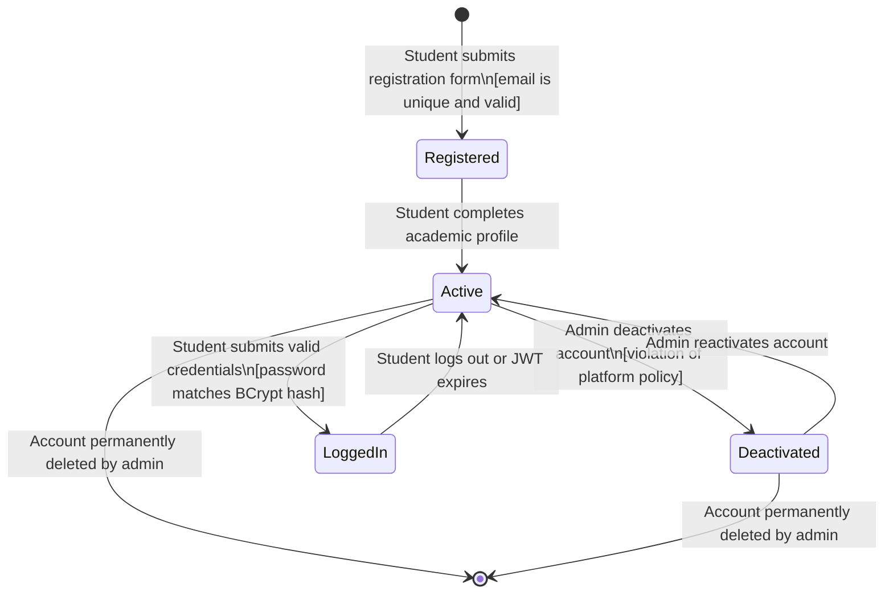
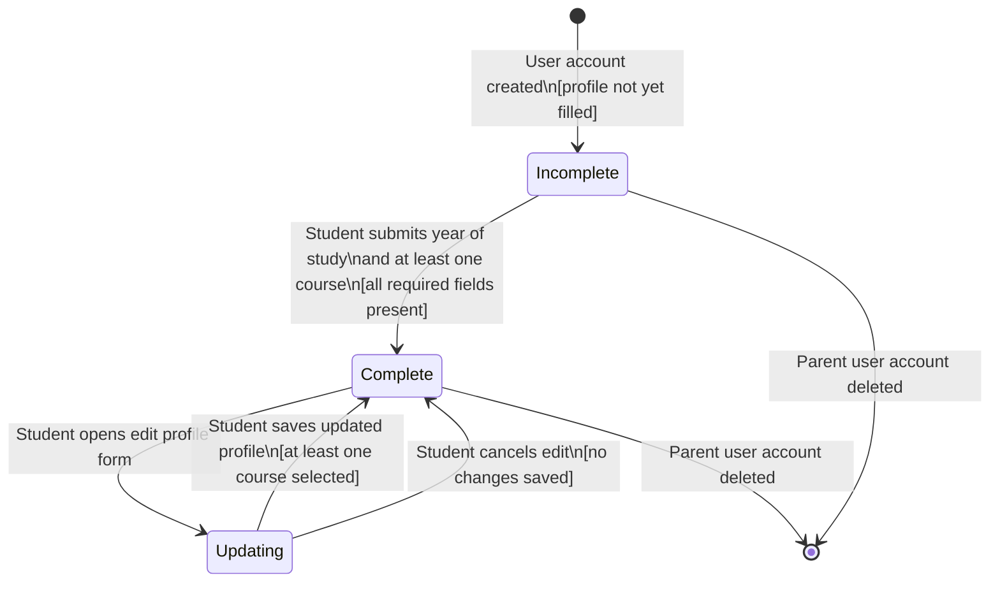
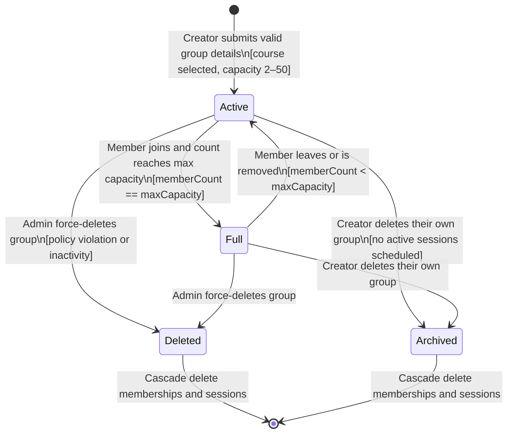
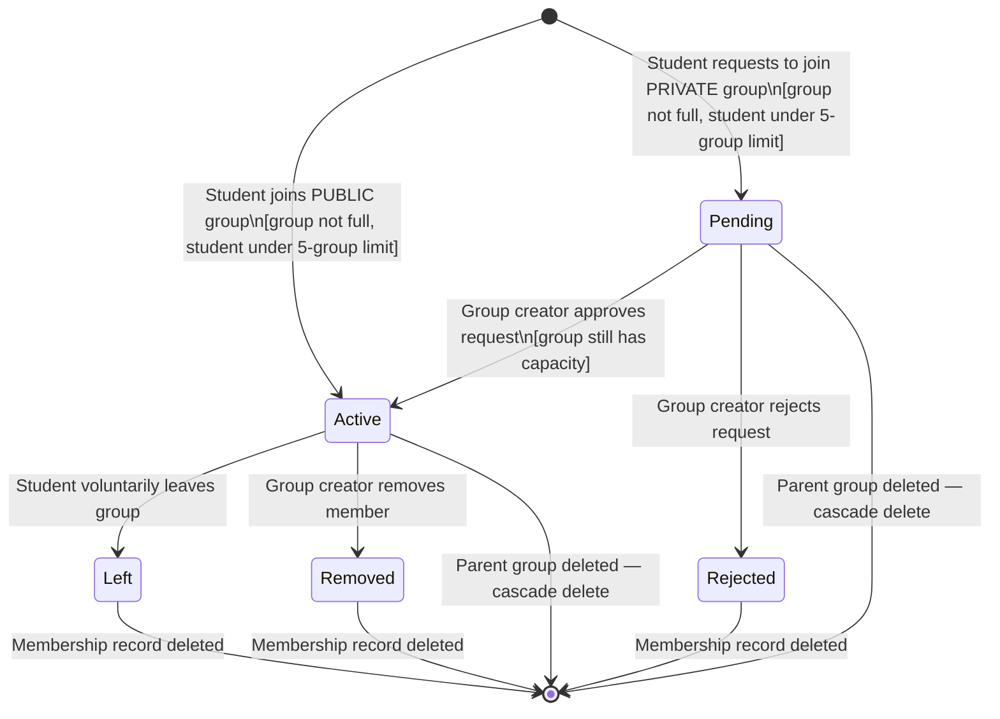
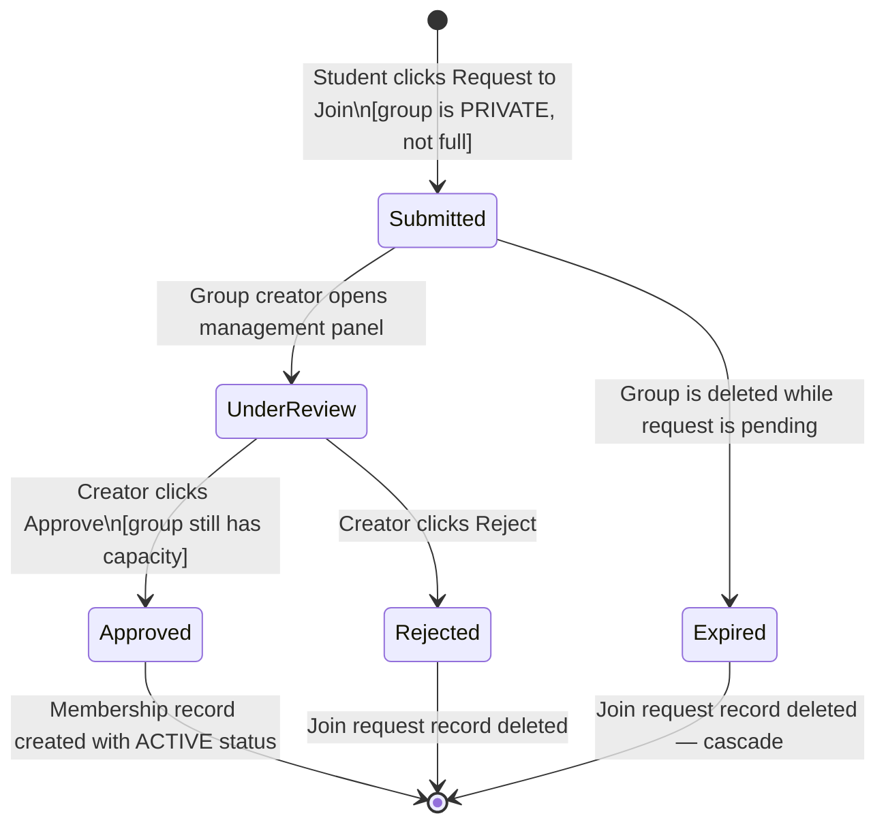
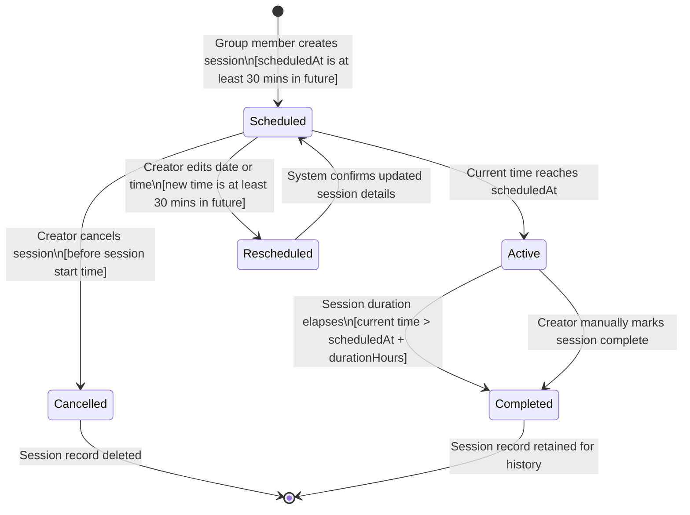
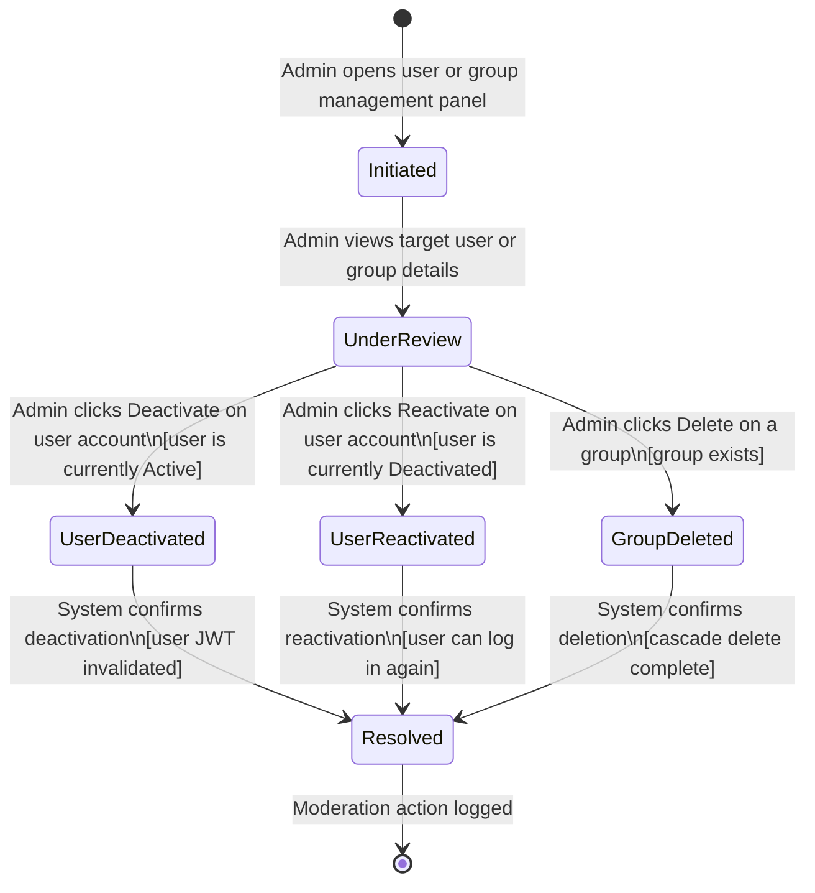
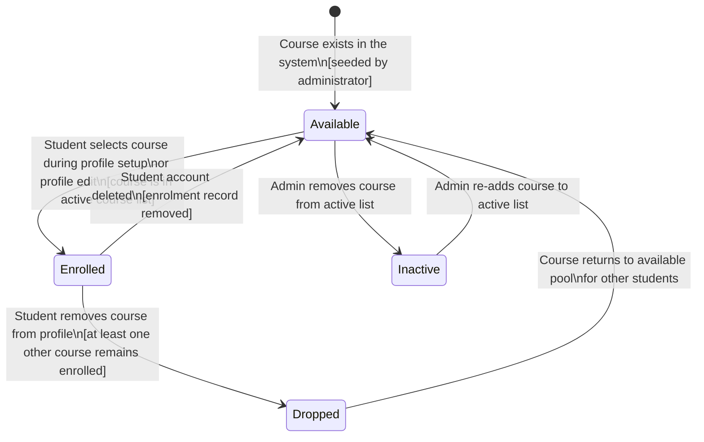

# STATE_DIAGRAMS.md — Object State Modeling
## StudySync: Study Group Finder System

---

## 1. Introduction

This document defines the lifecycle of 8 critical objects in the StudySync system using UML state transition diagrams. Each diagram shows the valid states an object can exist in, the events that trigger transitions between states, and any guard conditions that must be satisfied before a transition is allowed.

### Traceability
| Object | Linked FR | Linked US | Linked UC |
|---|---|---|---|
| User Account | FR-01, FR-02, FR-11 | US-001, US-002, US-012 | UC-01, UC-02 |
| Academic Profile | FR-03 | US-003, US-004 | UC-03 |
| Study Group | FR-04, FR-12 | US-005, US-013 | UC-04 |
| Membership | FR-06, FR-07, FR-08 | US-007, US-008, US-009, US-014, US-015 | UC-06, UC-07 |
| Join Request | FR-07 | US-008, US-009 | UC-07 |
| Study Session | FR-09, FR-10 | US-010, US-011, US-016 | UC-08 |
| Admin Moderation | FR-11, FR-12 | US-012, US-013 | — |
| Course Enrolment | FR-03 | US-003, US-004 | UC-03 |

---

## 2. Object 1 — User Account

### Explanation

The User Account object begins in **Registered** state immediately after a student submits valid registration details. It transitions to **Active** once the academic profile setup is complete — this two-step process ensures no account is fully active without course enrolment data. The **LoggedIn** state is a transient active state that exists while a valid JWT token is held by the client. **Deactivated** is a reversible state controlled exclusively by the Platform Administrator, addressing FR-11 (admin user management). Permanent deletion is a terminal transition available only to admins, leaving no orphan records in the database.

**Mapped to:** FR-01 (registration), FR-02 (login), FR-11 (admin deactivation), US-001, US-002, US-012

---

## 3. Object 2 — Academic Profile

### Explanation

The Academic Profile starts as **Incomplete** the moment a user account is created. It transitions to **Complete** only when the student provides their year of study and selects at least one course — the guard condition prevents empty profiles from being saved (addressing the acceptance criteria in US-003). The **Updating** state captures the period between opening the edit form and saving, allowing the system to validate changes before committing them. This object has no independent terminal state — its lifecycle is tied to the parent User Account.

**Mapped to:** FR-03 (profile setup and edit), US-003 (setup), US-004 (edit)

---

## 4. Object 3 — Study Group

### Explanation

A Study Group enters **Active** state immediately upon creation — there is no draft or pending state since validation happens before the record is created. The **Full** state is reached automatically when the member count equals the maximum capacity set by the creator; this is not an admin action but a system-calculated state. Transitions between Active and Full are bidirectional because members can leave at any time. Both **Deleted** (admin action) and **Archived** (creator action) are terminal states that cascade-delete all associated memberships and sessions, satisfying the data integrity NFR.

**Mapped to:** FR-04 (create), FR-06 (join triggers Full), FR-08 (leave triggers Active), FR-12 (admin delete), US-005, US-013

---

## 5. Object 4 — Membership

### Explanation

Membership is the most complex object in StudySync because it has two possible entry paths — instant Active for public groups and Pending for private groups. The **Pending** state exists only for private group requests and is resolved exclusively by the group creator. The guard condition on approval (`group still has capacity`) prevents a race condition where a group fills up while a request is pending. **Left** and **Removed** are semantically distinct terminal transitions: Left is student-initiated, Removed is creator-initiated, but both result in the membership record being deleted.

**Mapped to:** FR-06 (public join), FR-07 (private request), FR-08 (leave/remove), US-007–US-009, US-014–US-015, UC-06, UC-07

---

## 6. Object 5 — Join Request

### Explanation

The Join Request is a short-lived object that exists only for private group membership flows. It separates the act of requesting (Submitted) from the act of reviewing (UnderReview), making it clear whether a creator has seen the request or not. The **Expired** state handles the edge case where a group is deleted while requests are still pending — all requests must be cleaned up via cascade deletion to prevent orphan records. Upon approval, the Join Request object is replaced by a Membership object with Active status.

**Mapped to:** FR-07 (join request workflow), US-008, US-009, UC-07

---

## 7. Object 6 — Study Session

### Explanation

A Study Session starts in **Scheduled** state and transitions to **Active** automatically when the wall clock reaches the session's scheduled time — this is a system-driven transition, not a user action. **Rescheduled** is a transient state between the edit action and the confirmation of new details; it transitions back to Scheduled once the new time is validated. **Cancelled** is a terminal state with deletion, while **Completed** is retained for history (students can view past sessions per FR-10). The guard condition on creation (`at least 30 mins in future`) matches the acceptance criteria in US-010.

**Mapped to:** FR-09 (schedule), FR-10 (view), US-010, US-011, US-016, UC-08

---

## 8. Object 7 — Admin Moderation Action

### Explanation

The Admin Moderation Action is a process object — it does not persist in the database as a single record but represents the lifecycle of an admin's interaction with the management dashboard. The **UnderReview** state is important because it represents the moment between an admin viewing a target and taking action — providing a conceptual pause before irreversible actions. All terminal outcomes funnel through **Resolved** before being logged, ensuring auditability. This object maps directly to the admin stakeholder concerns identified in STAKEHOLDERS.md.

**Mapped to:** FR-11 (user management), FR-12 (group moderation), US-012, US-013

---

## 9. Object 8 — Course Enrolment

### Explanation

The Course Enrolment object models the relationship between a student and a course in the system. Courses are pre-seeded by an administrator and start as **Available** — students select from this pool, not free-text. The guard condition on Dropped (`at least one other course remains enrolled`) prevents students from having an empty profile, which would make group search meaningless. The Inactive state allows administrators to retire course codes at the end of a semester without deleting historical data.

**Mapped to:** FR-03 (academic profile with courses), US-003, US-004, UC-03
